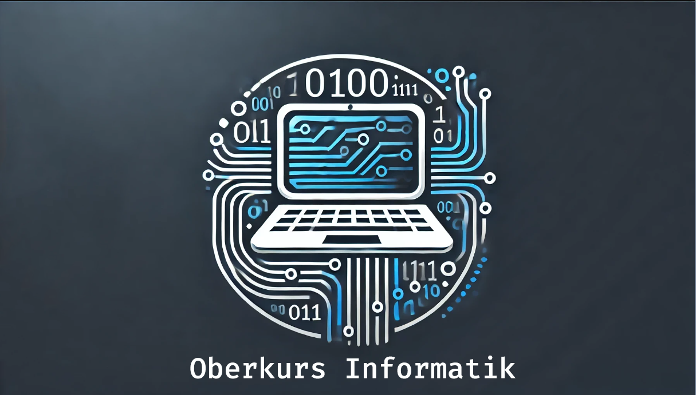

<!--
author:   Tilman Schieber
email:    tilman.schieber@tu-berlin.de
version:  1.2.0
date:     2024
language: de
logo:     img/oberkurs_logo.png
icon:     img/TU_Logo_kurz.png
comment:  Oberkurs Informatik am Studienkolleg der
          Technischen Universität Berlin.
link:     styles/main.css

@style

h1 {
  display: none;
}

img.card__logo {
  height: 20px !important;
}

@end
-->

# Oberkurs Informatik

<!-- class="lead" -->
Willkommen beim Oberkurs Informatik am Studienkolleg der Technischen Universität Berlin.

---

Python Programmierkurs
======================
[preview-lia](1_Einfuehrung.md)
[preview-lia](2_Werte&Variablen.md)
[preview-lia](3_Entscheidungen.md)

[preview-lia](4_Wiederholung.md)

Einführung Betriebssysteme
==========================
[preview-lia](A_Linux.md)
