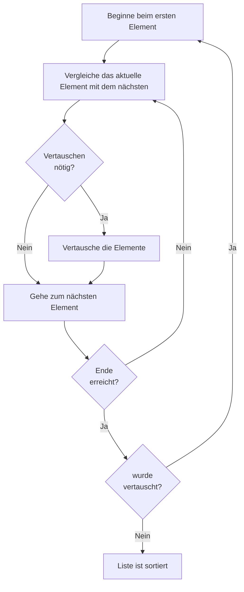

<!--
author:   Tilman Schieber
email:    tilman.schieber@tu-berlin.de
version:  0.0.1
date:     2024
language: de
narrator: Deutsch Female
logo:     img/1/classroom2.png
icon:     img/TU_Logo_kurz.png
comment:  Was bedeutet es einen Computer zu programmieren und 
          wie lernt man es?
import:   https://raw.githubusercontent.com/LiaTemplates/Pyodide/master/README.md
import:   https://raw.githubusercontent.com/liaScript/mermaid_template/master/README.md
import:   ./macros.md
link:     styles/main.css

-->


# 1. Was ist Programmieren?


                  {{|> US English Male}}
> “Everybody should learn to program a computer because it teaches you how to think.”
>
> -- Steve Jobs
 
Programmieren ist der Prozess, Anweisungen so zu formulieren, dass ein Computer sie verstehen und ausführen kann. Zunächst muss das Problem in einer Weise strukturiert und beschrieben werden, dass es von einem Computer Schritt für Schritt gelöst werden kann. Diese strukturierten Anweisungen werden als Algorithmus bezeichnet. Anschließend wird der Algorithmus in eine Programmiersprache übersetzt, die der Computer versteht. Das Ergebnis ist ein Programm, das vom Computer ausgeführt werden kann.


## Von der Idee zum Algorithmus
<!--style = "width: 200px;"-->

Das Wort Algorithmus leitet sich vom Namen eines persischen Mathematikers, *al-Chwarizmi*[^1] (خوارزمی), ab, der Lösungswege für zahlreiche mathematische Probleme entwickelte und mit seinem Buch über Algebra einen großen Einfluss auf die Entwicklung der Mathematik hatte.

Ein Algorithmus ist eine systematische Vorgehensweise zur Lösung eines Problems bzw. einer Aufgabe. In der Informatik wird ein Problem durch eine Eingabe (was ist gegeben) und eine Ausgabe (was möchte man erhalten) beschrieben. Eine einfache Additionsaufgabe kann wie folgt definiert werden. 

_Man bekommt zwei Zahlen als Eingabe und möchte als Ausgabe die Summe dieser beiden Zahlen._

Ein Algorithmus für dieses Problem ist aus der Schule bekannt: 

_Schreibe eine Zahl unter die andere und addiere Stelle für Stelle._

[^1]: s. [Wikipedia - Al Chwarizmi](https://de.wikipedia.org/wiki/Al-Chwarizmi)

### Ein einfacher Algorithmus

Die schriftliche Addition, wie wir Sie aus der Schule kennen, ist ein einfacher Algorithmus.
Ausführlich beschreiben kann man ihn wie folgt:

<div class="flex-container">
<!-- class="flex-child" style="min-width: 250px" -->
@[embed(style="height: 380px; border: none")](html/1/addieralgorithmus.html)


<div class="flex-child alert alert-blue" style="min-width: 500px">

<!-- class="lead" -->
**Algorithmus zur schriftlichen Addition**

---

1. Schreibe die zwei Zahlen untereinander, sodass die Stellenwerte (Einer, Zehner, Hunderter, etc.) übereinander stehen.
2. Wiederhole für jede Spalte von rechts nach links:

    * Addiere die Ziffern der aktuellen Spalte 
    * Wenn die Summe 10 oder mehr ist, übertrage 1 zur nächsten linken Spalte.
    * Schreibe den Einerwert der Summe unter die aktuelle Spalte

---

_Klicken Sie links auf den "play"-Knopf um die Animation dieses Algorithmus zu starten_

</div>
</div>


### Algorithmen in der Mathematik
Die schriftliche Addition ist für uns Menschen ein sehr nützlicher Algorithmus, da es schwierig ist, mehrstellige Zahlen im Kopf zu addieren. Für viele weitere mathematische Probleme gibt es teils viele verschiedene Algorithmen um sie zu lösen. Hier sind drei berühmte Beispiele: 

- das Berechnen der Wurzel einer Zahl [^1]
- das Finden von Primzahlen [^2]
- die Berechnung des größten gemeinsamen Teilers (ggT) zweier Zahlen [^3]


[^1]: s. [Wikipedia - Sieb des Eratosthenes](https://de.wikipedia.org/wiki/Sieb_des_Eratosthenes)
[^2]: s. [Wikipedia - Heron Verfahren](https://de.wikipedia.org/wiki/Heron-Verfahren)
[^3]: s. [Wikipedia - Euklidischer Algorithmus](https://de.wikipedia.org/wiki/Euklidischer_Algorithmus)


### Die Welt der Algorithmen

Auch wenn die Studie der Algorithmen in der Mathematik ihren Anfang nahm, kommen Algorithmen nun in allen möglichen Bereichen zum Einsatz, so z.B. für 

- das Sortieren von `Zeilen` in einer Excel-Tabelle
- das Verschlüsseln geheimer Daten beim Online Banking
- das Berechnen des besten Wegs bei der Routenplanung
- die Empfehlung des nächsten Youtube-Videos
- die Generierung von Bildern aus einer Textbeschreibung mittels künstlicher Intelligenz

Während einige dieser Probleme und die dazugehörigen Algorithmen sehr komplex sind, ist das erste Beispiel, das Sortieren, eine alltägliche Aufgabe und kann mit einem einfachen Algorithmus gelöst werden.

> Stellen Sie sich vor, sie haben einen Stapel unsortierter Spielkarten und sie sollen diese aufsteigend nach ihrem Wert sortieren.
> Wie würden Sie das machen?
> 
>    [[___ ___ ___ ___]]


### Bubble Sort
Die am einfachsten zu beschreibende Sortiermethode ist das sogenannte *Bubble Sort*

<div class="alert alert-yellow">
Dabei wird der Reihe nach jede Karte mit ihrem Nachbar verglichen, sind sie nicht richtig sortiert, werden sie getauscht.
Ist man am Ende der Reihe angekommen beginnt man von vorne bis kein Tausch mehr nötig ist.
</div>


Dabei wird der Reihe nach jede Karte mit ihrem Nachbar verglichen, sind sie nicht richtig sortiert werden sie getauscht.
Ist man am Ende der Reihe angekommen beginnt man von vorne bis kein Tausch mehr nötig ist.


!?[Bubblesort](https://youtu.be/zeujn6wrnKc)

Ausführlich kann man den Algorithmus für eine Liste aus vergleichbaren Elementen so formulieren:

<div class="alert alert-blue">

<!-- class="lead" -->
**Algorithmus Bubble Sort**

---

*Eingabe:* eine unsortierte Liste<br>
*Ausgabe:* die sortierte Liste

---

1. Beginne beim ersten Element 
2. Vergleiche das aktuelle Element mit dem nächsten
3. Vertausche die Elemente wenn nötig
4. Gehe zum nächsten Element
5. Wiederhole 2.-4. bis das letzte Element erreicht ist
6. Wenn in diesem Durchlauf kein Element vertauscht wurde, ist die Liste sortiert.
7. Ansonsten gehe zu 1.

---

</div>


Hier sehen Sie wie Bubble Sort mit einer zufälligen Liste funktioniert:

@[embed(style="height: 245px; width:670px; border: none")](html/1/bubblesort.html)

#### Flussdiagramm: Bubble Sort

> EIn Flussdiagramm (englisch *Flowchart*) ist eine übersichtliche Weise einen Algorithmus zu skizzieren.
> Flussdiagramme haben noch viele weitere Anwendungsmöglichkeiten und es gibt sie in vielen Varianten.
> Wir verwenden eine sehr einfache Version:
>
> - Wir beginnen oben und folgen den Pfeilen
> - Anweisungen stehen in einem Rechteck
> - Entscheidungen stehen in einer Raute, nach einer Entscheidung folgen wir dem jeweils richtigen Pfeil.
> - Sind wir ganz unten angekommen, so sind wir fertig.

<!--style="max-width: 450px;margin:3em"-->


### ❓Fragen

Welche der folgenden Aussagen sind wahr?
------------------------------------------

- [[X]] Algorithmen sind nach einem persischen Mathematiker benannt
- [[ ]] Der Sieb des Eratosthenes ist ein Algorithmus zur Berechnung der Quadratwurzel
- [[X]] Beim Programmieren übersetzt man Algorithmen in die Sprache des Computers
- [[ ]] Jedes mathematische Problem hat immer genau eine mathematische Lösung
- [[ ]] Algorithmus ist das lateinische Wort für Computerprogramm
*********************************************
* Der Sieb des Eratosthenes ist ein Algorithmus zur Bestimmung von Primzahlen.
* Das Wort Algorithmus leitet sich vom Namen des persischen Mathematikers Al-Chwarizmi ab.
*********************************************

---

Woher kommt der Name Bubble Sort?
----------------------------------------

- [( )] Der Erfinder war ein Programmierer mit dem Spitznamen "Bubbles"
- [( )] Frühe Röhrencomputern nutzten sogenannten "Bubble Memory" um Daten zu speichern.
- [( )] Der Algorithmus wurde von einem Programmierer in einem Sprudelbad erfunden.
- [(X)] unsortierte Elemente bewegen sich wie aufsteigende Luftblase ans Ende der Liste.

---

Sortieren Sie diese Liste mit Bubble Sort. Wie viele Vertauschungen sind nötig?
-------------------------------------------------------------------------------

<!--style="max-width: 400px;"-->
```ascii
.----..----..----..----..----..----.
| 10 || 14 ||  1 || 15 || 34 || 20 |
.----..----..----..----..----..----.
```         

- [( )] 6
- [(X)] 3
- [( )] 2
- [( )] 9
*********************************************

im ersten Durchgang *zwei* Vertauschungen:

<!--style="max-width: 400px;"-->
```ascii
                          
          <-->              <-->     
.----..----..----..----..----..----.
| 10 ||  1 || 14 || 15 || 20 || 34 |
.----..----..----..----..----..----.
```

im zweiten Durchgang *eine* Vertauschung: 

<!--style="max-width: 400px;"-->
```ascii
    <-->                          
.----..----..----..----..----..----.
| 10 ||  1 || 14 || 15 || 20 || 34 |
.----..----..----..----..----..----.
```

Insgesamt also drei!
  
*********************************************
---


## Vom Algorithmus zum Programm

Direkt verstehen kann ein Computer nur die sogenannte Maschinensprache. Diese kann z.B. so aussehen:

```
B8 01 00 BB 02 00 01 D8   
```

Verschiedene Prozessoren verstehen unterschiedliche Arten von Maschinensprache, da sie sich in ihrer Hardwarearchitektur[^1] unterscheiden.
Übersetzt man diesen Code in eine menschenlesbare Form sieht es so aus:

```asm
MOV AX, 0001h
MOV BX, 0002h
ADD AX, BX 
```
Dieses Programm lädt 1 und 2 in Register[^2], addiert deren Inhalt und speichert das Ergebnis in AX.
Diese Darstellung ist eine direkte Vorstufe der Maschinensprache und wird *Assembler* genannt.
Für die meisten praktischen Anwendungen bevorzugt man jedoch sogenannte höhere Programmiersprachen. Diese Sprachen sind leichter zu schreiben und zu verstehen, und ermöglichen es, komplexe Aufgaben ohne detailliertes Wissen über die zugrundeliegende Hardware zu lösen. Beispiele für höhere Programmiersprachen sind Python, Java, und C++.

In einer höheren Programmiersprache könnte das oben beschriebene Programm so aussehen:

```python
AX = 1
BX = 2
AX = AX + BX
```


[^1]: So haben z.B. Smartphones, PCs oder Macs unterschiedliche Hardwarearchitekturen und verstehen nicht die selbe Maschinensprache.
[^2]: dabei handelt es sich um einen Speicherplatz direkt im Prozessor. AX,BX und CX sind verschiedene Register.
[^3]: **Python** ist eine höhere Programmiersprache, die für ihre Einfachheit und Vielseitigkeit bekannt ist. Sie wird häufig für Webentwicklung, Datenanalyse, künstliche Intelligenz und wissenschaftliches Rechnen verwendet. Python ist leicht verständlich und einsteigerfreundlich, weshalb wir es in diesem Kurs verwenden werden.
Die *Backends* (Server-Systeme) des sozialen Netzwerks *Instagram*, des Musikstreamingdienstes *Spotify* und des Videostreamingdienstes *Netflix* sind zu großen Teilen in Python programmiert.

[^4]: **Java** ist eine plattformunabhängige Programmiersprache, die besonders für ihre Stabilität und Sicherheit bekannt ist. Java wird häufig in Unternehmensanwendungen und Android-Apps eingesetzt. Das Computerspiel *Minecraft*, die Steuersoftware des Mars Rovers und die *Wikipedia*-Suche sind alle in Java programmiert.

[^5]: **C++** ist eine leistungsstarke Programmiersprache, die auf der Programmiersprache C basiert. C++ wird für Spieleentwicklung, Echtzeitanwendungen und Software, die hohe Performance-Anforderungen stellt, verwendet. *Microsoft Office*, der Betriebssystemkern von *Linux* und das Computerspiel *Diablo 3* sind in C++ programmiert.


## Hallo Python!

@[embed(style="height: 400px; width:700px; border: none")](html/1/console.html)


