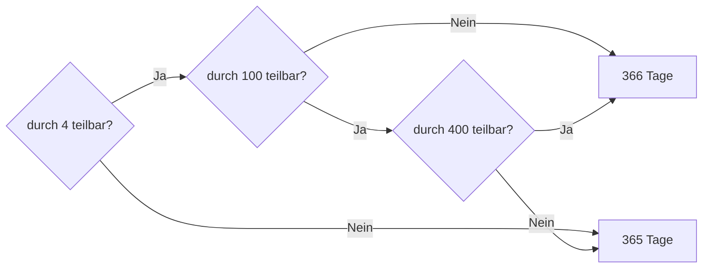

<!--
author:   Tilman Schieber
email:    tilman.schieber@tu-berlin.de
version:  1.0.3
date:     2024
language: de
narrator: Deutsch Female
logo:     img/3/decisions.png
icon:     img/TU_Logo_kurz.svg
comment:  Setzen Sie Logik ein, um den Fluss eines Programmes zu steuern
          und so Entscheidungen zu treffen. 
import:   https://raw.githubusercontent.com/LiaTemplates/Pyodide/master/README.md
import:   https://raw.githubusercontent.com/liaScript/mermaid_template/master/README.md
import:   macros/macros.md
link:     styles/main.css

-->

# 3. Entscheidungen


<div class="flex-container align-center my-4">

<div class="flex-child">


</div>

<div class="flex-child-2 mx-3">

<h4>Lernziele</h4>

In diesem Kapitel lernen Sie, mit Python Entscheidungen zu treffen und so den Fluss eines Programmes zu steuern. 
Am Ende können Sie:

1. Boolesche Logik in Python anwenden.
2. Logik einsetzen um den Fluss eines Programmes zu steuern.
3. Das `if`-Statement, `else` und `elif` verwenden.


</div>

</div>

<!-- class="context"-->
Der Stoff in diesem Kapitel baut auf die Grundlagen in @[lialink(Kapitel 2: Werte und Variablen)](2_Werte&Variablen.md) auf.\
Für einen Gesamtüberblick über den Kurs geht es @[lialink(hier zurück zur Kursübersicht)](0_Inhalt.md).


## Boolesche Ausdrücke

Um Enscheidungen zu treffen, benutzen Programmiersprachen die boolesche Logik, die Sie in dieser Lerneinheit kennengelernt haben. Für wahr und falsch werden die englischen Begriffe "True" und "False" verwendet. Beide beginnen in Python mit einem Großbuchstaben.

Boolesche Ausdrücke haben in Python den Datentyp `bool` – das steht kurz für *boolean*. Das sehen wir, wenn wir die Funktion `type` verwenden:

``` python
type(False)
```
@Pyodide.eval

Python kennt auch die drei wichtigsten Verknüpfungen der booleschen Algebra: NICHT, UND, ODER. Sie werden in englisch und klein geschrieben. Sie lauten also `not`, `and`, `or`.
Mit diesen drei Grundbausteinen kann Python boolesche Ausdrücke auswerten:

``` python
print(not False)
print(True and False)
print(False or False)
print(not (False or False))
```
@Pyodide.eval[^1]

Boolesche Ausdrücke können auch Variablen enthalten: So weisen wir hier den Variablen  `a` und `b` jeweils einen Wahrheitswert zu und verwenden die Variablen dann in einem booleschen Ausdruck:

``` python
a = True
b = False
nor_ab = not (a or b)
xor_ab = (a and not b) or (not a and b)
print("A nor B: ", nor_ab)
print("A xor B: ", xor_ab)
```
@Pyodide.eval

Sie sehen, dass wir Python als eine Art Logik-Taschenrechner verwenden können.

[^1]: Wir verwenden in diesem Beispielcode die `print`-Funktion wenn mehrere Werte ausgegeben werden müssen. Ohne ein `print`-Statement wird immer nur das Ergebnis der letzten Zeile ausgegeben.

## Vergleichsoperatoren in Python

Die Wahrheitswerte `True` und `False`, und auch boolesche Variablen werden beim Programmieren selten direkt genutzt. Stattdessen werden sie häufig in Verbindung mit sogenannten Vergleichsoperatoren eingesetzt. Mit Vergleichsoperatoren kann man zum Beispiel auf Gleicheit prüfen:

``` python
print(0 == 0)
print(0 == 5)
print(5 == 5.0)
print("Hallo" == "Hallo")
```
@Pyodide.eval

Diese Werte sind also alle gleich, der Vergleich mit `==` gibt den *bool* Wert `True` zurück.

Beachten Sie den Unterschied zwischen der Zuweisung (ein einfaches Gleichheitszeichen) und einem Vergleich (zwei Gleichheitszeichen): 

Mit dem Operator `!=` kann man auf Ungleichheit prüfen:

``` python
print(1 != 2)
print(1 != 1.0)
```
@Pyodide.eval

Größenvergleiche sind mit den Operatoren `>` (größer) und `<` (kleiner) möglich.
Die Operatoren `>=` (größer gleich) und `<=` (kleiner gleich) funktionieren ähnlich, erlauben aber auch, dass beide Parameter gleich sind.

``` python
print(5 > 3)
print(3.141 >= 3)
print(-5 > 4)
print(1 < 1)
print(1 <= 1)
```
@Pyodide.eval

Vergleichsoperatoren können Sie miteinander und mit den booleschen Verknüpfungen kombinieren: So kann man beispielsweise testen, ob die Variable x größer als null und kleiner gleich 100 ist:

``` python
x = 23
(x>0) and (x<=100)
```

etwas eleganter schreiben wir:

``` python
0 < x <= 100
```

Wir können auch überprüfen, ob `x` ungerade ist: 

``` python
x % 2 == 1 
```


### Übungen

<div class="alert exercise">	

Was ist wahr?
-------------

Welche der folgenden Ausdrücke in Python werden als wahr ausgewertet?

---

- [[X]] `2 == 2 and 3 == 3`
- [[ ]] `not(5.0 >= 5) or 5.0 > 5`
- [[X]] `80 % 2 == 0`
- [[ ]] `not True or not False and not True`
- [[X]] `not not not not True`
- [[X]] `2 < 5 > 2`
- [[ ]] `1 > 2 > 3 > 4 > 5`
**********************************
Testen Sie es selbst:

``` python
print(2 == 2 and 3 == 3)
print(not(5.0 >= 5) or 5.0 > 5)
print(80 % 2 == 0)
print(not True or not False and not True)
print(not not not not True)
print(2 < 5 > 2)
print(1 > 2 > 3 > 4 > 5)
```
@Pyodide.eval

**********************************

</div>


----

<div class="alert exercise">	

Teilbar!
--------

Wir formuliert man den folgenden Satz in Python?\
*"Ist die Zahl x durch 3 und durch 5 teilbar und größer als 100?"*

---

-[( )] `x % 3 == 0 or x % 5 == 0 and x > 100`
-[(X)] `x % 3 == 0 and x % 5 == 0 and x > 100`
-[( )] `x % 3 and 5 == 0 and x > 100`
-[( )] `(x % 3 and x% 5 ) == 0 and x > 100`
**********************************

Durch drei teilbar ist x, wenn `x % 3 == 0` ist.\
Durch fünf teilbar ist x, wenn `x % 5 == 0` ist.\
Größer als 100 ist x, wenn `x > 100` ist.\
Da alle drei Bedingungen wahr sein müssen, verknüpfen wir sie mit `and`:

``` python
x % 3 == 0 and x % 5 == 0 and x > 100
```

**********************************

</div>


## Entscheidungen in Python

Eine der wichtigsten Grundstrukturen der Programmierung ist die Alternativanweisung. Je nachdem, ob ein Test wahr oder falsch ist, wird zwischen zwei möglichen Anweisungsblöcken **A** und **B** entschieden.  

Der Test ist dabei ein boolescher Ausdruck, wie Sie ihn gerade kennengelernt haben.
 
So kann beispielsweise getestet werden, ob eine Variable n kleiner als 100 ist.
Falls ja, wird sie um eins erhöht. Falls nein, wird sie auf 100 gesetzt.
 
Python verwendet für die Alternativanweisung das Schlüsselwort `if`. Auf `if` folgt ein boolescher Ausdruck. Den nennen wir hier `TEST`. Danach schreiben wir einen Doppelpunkt. Darauf folgen eine oder mehrere eingerückte Zeilen Code. Diese werden nur dann ausgeführt, wenn der boolesche Ausdruck wahr ist. Optional kann mit dem Schlüsselwort `else` ein weiterer eingerückter Codeblock eingeleitet werden. Dieser wird ausgeführt, wenn `TEST` falsch ist:

``` python
if TEST:
    # wenn TEST == True
else:
    # wenn TEST == False
```

<div class="alert definition">

Blöcke und Einrückungen
------------------------

Die Einrückung bestimmt in Python, welche Anweisungen zu einem Block gehören. Ein Block beginnt immer mit einem Doppelpunkt und endet, wenn die nächste Zeile nicht mehr eingerückt ist.Die Einrückung erfolgt in der Regel mit vier Leerzeichen. 

Rücken Sie Code ein, ohne einen Doppelpunkt zu setzen, oder tippen Sie ein Leerzeichen zu viel oder zu wenig führt das zu einem Fehler.

Codeblöcke können auch ineinander verschachtelt werden und damit tiefer eingerückt sein. Es wird jedoch empfohlen, nicht mehr als drei Ebenen zu verschachteln, da der Code sonst schwer zu lesen wird. [^1]


</div>

In einem konkreten Beispiel setzen wir zunächst den Wert von `n` auf 10. Dann testen wir ob `n` kleiner als 100 ist. Falls ja, soll `n` um eins erhöht werden. Falls nein, soll es auf 100 gesetzt werden:

``` python
n = 10
if n < 100:
   n = n + 1 
else:
   n = 100

n
```
@Pyodide.eval


Im nächsten Beispiel testen wir, ob eine Zahl gerade ist. Mit der `print`-Funktion geben wir die entsprechende Information auf dem Bildschirm aus. Ist es wahr, dass `x` gerade ist, wird der erste Block ausgeführt. Wenn es falsch ist, wird der zweite, der else-Block, ausgeführt. In diesem Fall ist `x` gleich zwölf und damit gerade:

``` python
x = 12
if x % 2 == 0:
    print("x ist gerade")
else:
    print("x ist ungerade")

```
@Pyodide.eval


Ändern Sie den Wert Variablen auf eine ungerade Zahl und führen erneut den Codeblock aus!

Wie erwähnt, ist der else-Block optional. Außerdem kann ein Block aus mehreren Anweisungen bestehen:
Hier setzen wir eine boolesche Variable auf den Wert `True`, und führen dann in Abhängigkeit dieser Variable Anweisungen aus:

``` python
fehler = True

if fehler:
    print("Fehler")
    print("--------------------------------")
    print("Bitte erneut versuchen!")
```
@Pyodide.eval

Die Variable `fehler` kann hier alleine als Test verwendet werden. `if fehler` ist das gleiche wie `if fehler == true`.
Im Fehlerfall werden also alle eingerückten Anweisungen ausgeführt. 
Probieren Sie doch mal `fehler=False` zu setzen und entfernen Sie eine oder mehrere Einrückungen!

[^1]: Laut den [offiziellen Empfehlungen](https://peps.python.org/pep-0008/#code-lay-out) sollte eine Einrückung aus vier Leerzeichen bestehen und eine Zeile sollte unter 80 Zeichen lang sein. Je mehr Einrückungen Sie verwenden, desto schneller wird die Zeile zu lang.


### Übungen

<div class="alert exercise">

Lückentext
-----------

``` python
if ____:
    print("x ist ungerade und positiv")

```

Welcher Ausdruck fehlt in der Lücke nach `if`?

- [( )] `x % 2 != 1 and x > 0`
- [( )] `not x%2==0 and x >= 0`
- [(X)] `not x%2==0 and x > 0`
- [( )] `not (x%2==0 and x >= 0)`
*************************************
Da 0 keine positive Zahl ist, ist `x > 0` wahr für positive Zahlen.\
Gerade Zahlen sind durch 2 teilbar, also ist `x % 2 == 0` wahr für gerade Zahlen. Damit ist die Negation `not x % 2 == 0` wahr für ungerade Zahlen.\
Damit ist `not x%2==0 and x > 0` hier die einzig richtige Antwort.
*************************************

</div>

<div class="alert exercise">

Fehlersuche
-----------

Welche Fehler hat der folgende Python-Code?

<!-- data-showGutter="true" -->
``` python
if x=>1900 and x<2000
    print("Das Jahr liegt im 20. Jahrhundert")
elseif x>=2000 and x<2100:
    print("Das Jahr liegt im 21. Jahrhundert")
else:
    print("Das Jahr liegt vor 1900")
```

- [[ ]] In Zeile 1 fehlen Klammern um die Bedingung.
- [[X]] Es fehlt ein Doppelpunkt nach der ersten Bedingung.
- [[X]] `elseif` muss durch `elif` ersetzt werden.
- [[ ]] Wenn es ein `elseif` Statement gibt darf kein `else` Statement folgen. 
- [[X]] in Zeile 1 muss `>=` statt `=>` stehen.
*************************************
Korrigiert sieht der Code so aus:

<!-- data-showGutter="true" -->
``` python
if x>=1900 and x<2000:
    print("Das Jahr liegt im 20. Jahrhundert")
elif x>=2000 and x<2100:
    print("Das Jahr liegt im 21. Jahrhundert")
else:
    print("Das Jahr liegt vor 1900")
```
*************************************


</div>

<div class="alert exercise">

Einrückung
-----------

Bei diesem Quellcode sind alle Einrückungen verloren gegangen.\
Fügen Sie Leerzeichen hinzu bis es ohne Fehler funktioniert:

<!-- data-showGutter="true" -->
``` python
x = 24
if x % 2 == 0:
if x > 100:
print("x ist eine gerade Zahl größer als 100")
else:
print("x ist eine gerade Zahl kleiner als 100")
else:
print("x ist ungerade")
```
@Pyodide.eval


</div>


## Komplexere Entscheidungen

Durch das Verschachteln von if-Anweisungen können mehrere Bedingungen geprüft werden:

``` python
if TEST1:
    # wenn TEST1 == true
else:
    if TEST2:
        # wenn TEST1 == false UND TEST2 == true
    else:
        # wenn TEST1 == false UND TEST2 == false
```

Eine Kurzschreibweise dafür ist mit `elif` möglich, eine Kombination von `else` und `if`:

``` python
if TEST1:
    # wenn TEST1 == true
elif TEST2:
    # wenn TEST1 == false UND TEST2 == true
else:
    # wenn TEST1 == false UND TEST2 == false
```

Diese Schreibweise ist äquivalent zum vorherigen Beispiel und soll vor allem die Lesbarkeit verbessern.


<div class="alert tip">

Bonus: `match`
---------------

In Python 3.10 (im Jahr 2021) wurde das `match`-Statement eingeführt, das eine weitere Möglichkeit bietet, mehrere Bedingungen zu prüfen. 

``` python
befehl=input()
match befehl:
    case "start":
        print("Starte Ausführung.")
    case "stop":
        print("Ausführung beendet.")
    case "pause":
        print("Pausiere...")
    case _:
        print("Unbekannter Befehl")
```
@Pyodide.eval

Auch wenn es in einigen Fällen die Lesbarkeit verbessern kann, werden Sie es in diesem Kurs nicht benötigen.

</div>


### ✍️ Aufgabe: Ammoniak


> Sie programmieren die Steuerung einer chemischen Anlage. 
> Dafür müssen Sie berechnen, in welchem Aggregatzustand (flüssig, fest, oder gasförmig) Ammoniak (NH<sub>3</sub>) vorliegt.

Um das zu entscheiden, müssen Sie den Schmelz- und Siedepunkt von Ammoniak recherchieren.

<details>

<summary>Tipp: Informationen zu Ammoniak</summary>

Diese Information finden Sie zum Beispiel hier:

- [Wikipedia: Ammoniak](https://de.wikipedia.org/wiki/Ammoniak)   
- Schmelzpunkt: −77,7 °C  
- Siedepunkt: −33 °C

</details>


<div class="alert exercise my-4">

Aufgabe
--------

Schreiben Sie ein Programm, das

1. die aktuelle Temperatur des Ammoniaks einliest
2. Mit einem oder mehreren if-statements den Aggregatzustand ermittelt
3. den aktuellen Aggregatzustand des Ammoniaks ausgibt, entweder "fest", "flüssig" oder "gasförmig"

</div>

[^1]: Bildquelle: [Wikimedia Commons](https://commons.wikimedia.org/wiki/File:Hermann_L%C3%BCtge_-_Ammoniaksyntheseapparat_aus_Die_BASF_HZ_1_1952_S._26.jpg)


### ✍️ Aufgabe: Schaltjahre 

* Ein [Schaltjahr](https://de.wikipedia.org/wiki/Schaltjahr)  ist ein Jahr, das durch vier teilbar ist
* *Aber:* Durch 100 teilbare Jahre sind keine Schaltjahre
* *Aber:* Durch 400 teilbare Jahre sind Schaltjahre

Dieses Diagramm veranschaulicht den Entscheidungsprozess:



<div class="alert exercise my-4">

Aufgabe
--------

Schreiben Sie ein Programm, das prüft, ob ein gegebenes Jahr ein Schaltjahr ist:

1. Lesen Sie ein Jahr vom Benutzer ein.
2. Wandeln Sie es in eine Ganzzahl um.
3. Überprüfen Sie, ob das Jahr ein Schaltjahr ist.
4. Geben Sie die Anzahl der Tage aus, die das Jahr hat (365 für normale Jahre, 366 für Schaltjahre).

</div>

