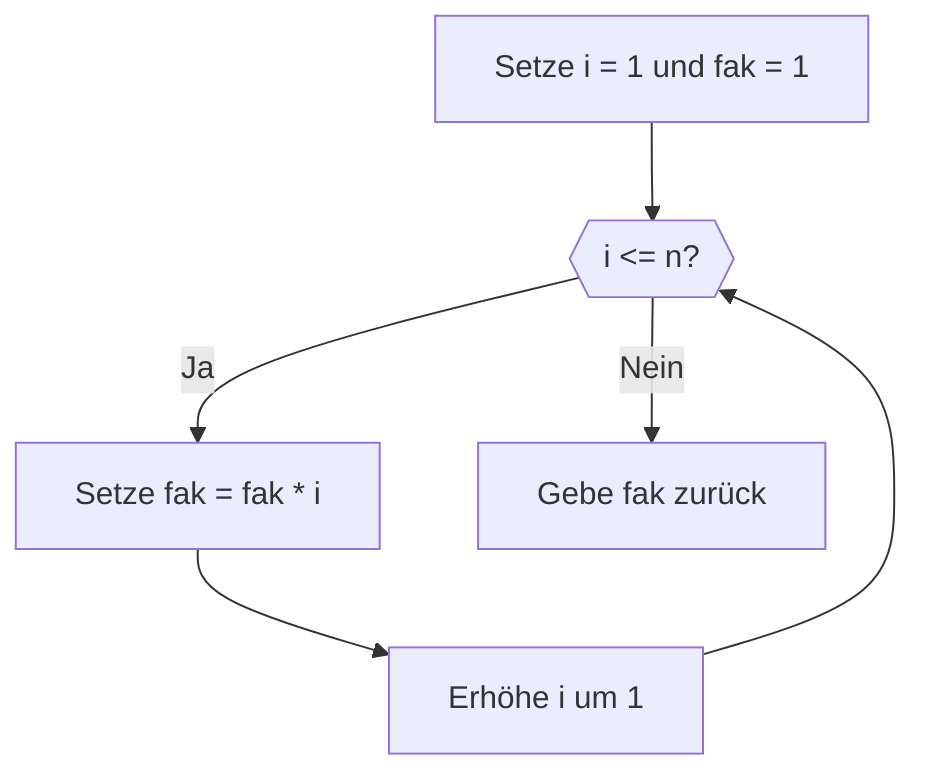

<!--
author:   Tilman Schieber
email:    tilman.schieber@tu-berlin.de
version:  0.0.1
date:     2024
language: de
narrator: Deutsch Female
logo:     img/4/repetition.png
icon:     img/TU_Logo_kurz.png
comment:  Wir lernen Schleifen und Listen einzusetzen, um den selben Code wiederholt auszuführen.
import:   https://raw.githubusercontent.com/LiaTemplates/Pyodide/master/README.md
import:   https://raw.githubusercontent.com/liaScript/mermaid_template/master/README.md
import:   macros/macros.md
link:     styles/main.css

-->

# 4. Wiederholung

<div class="alert alert-green">

<h4>Lernziele</h4>

In diesem Kapitel lernen Sie, wie Sie Schleifen und Listen in Python verwenden können, um den selben Code wiederholt auszuführen.

Am Ende können Sie:

1. Die Wichtigkeit von Wiederholung für Algorithmen verstehen.
2. Schleifen mit `while` und `for` verwenden
3. Die Liste und andere Sequenztypen verstehen.
4. Mit `for` Iterationen über Sequenzen anwenden.


</div>

## Wiederholung im Alltag

Ein wichtiger Bestandteil vieler Algorithmen ist die Wiederholung bestimmter Handlungsanweisungen. Auch bei vielen alltäglichen Handlungen spielt die Wiederholung eine wichtige Rolle.

<div class="alert alert-blue">

Beispiel 1: Treppensteigen
--------------------------
1. gehen Sie eine Treppenstufe hinauf. ⏺️
2. Falls Sie noch nicht oben sind, wiederholen Sie Schritt 1 🔁

---

Beispiel 2: Reifen am Auto wechseln
-----------------------------------

1. Führen Sie vier mal den nächsten Schritt aus: 🔁
2. Wechseln Sie einen Reifen ⏺️

---

Beispiel 3: Teigtaschen[^1] füllen
-------------------------------

1. Teilen Sie den ausgerollten Teig in gleich große Quadrate.
2. Nehmen Sie ein Quadrat und füllen es mit Füllung. ⏺️
3. Klappen Sie die Teigtaschen zu. ⏺️
4. Wiederholen Sie Schritte 2-3 für jedes Teigquadrat. 🔁

</div>

Dies sind Beispiele für eine Iteration. In der Informatik bezeichnet man so die Wiederholung einer Handlungsanweisung mit einem bestimmten Ziel. In der Programmierung spricht man auch von Schleifen.

Betrachten Sie die obigen Beispiele, sehen Sie die Gemeinsamkeiten: Jedes Beispiel besteht aus einem Schleifenrumpf (hier markiert mit dem Symbol ⏺️) und einer Schleifenkontrollanweisung (hier markiert mit 🔁). Der Schleifenrumpf enthält alle Anweisungen, die wiederholt werden können. Die Schleifenkontrollanweisung erklärt, unter welchen Bedingungen die Schleife wiederholt wird.

Diese drei Beispiele stehen für drei Schleifentypen:

1. **Bedingungsschleife:** Wiederholt bis eine Bedingung erfüllt ist _(siehe Beispiel 1, Treppensteigen)_
2. **Zählschleife:** Wiederholt eine bestimmte Anzahl an Malen. _(siehe Beispiel 2, Reifenwechsel)_
3. **Mengenschleife:** Wiederholt den Schleifenrumpf für jedes Element einer Menge _(siehe Beispiel 3, Teigtaschen)_


<div class="alert alert-yellow">

Übung
------

Welche Art von Schleifen benötigen die folgenden Algorithmen?

"Eine Musikplayer App spiele der Reihe nach alle Lieder einer Playlist"

[[Bedingungsschleife|Zählschleife|(Mengenschleife)]]

"Eine Klimaanlage kühlt den Raum so lange die Temperatur über 20 Grad ist."

[[(Bedingungsschleife)|Zählschleife|Mengenschleife]]

"Eine Eieruhr zählt die Sekunden bis die eingestellte Zeit abgelaufen ist und klingelt dann." 

[[Bedingungsschleife|(Zählschleife)|Mengenschleife]]

</div>

[^1]: in vielen Ländern isst man gefüllte Teigtaschen, man nennt sie z.B. Maultaschen, Пельмени, 饺子, ხინკალი, Ravioli, Mantı, Pierogi usw.

## Ein iterativer Algorithmus: Fakultät

Wir versuchen in der Informatik die unterschiedlichsten Problemstellungen mit Hilfe von Algorithmen zu lösen. Die Wiederholung, oder auch Iteration ist dafür ein wichtiger Grundbaustein.  

Als ein Beispiel dafür wollen wir die Berechnung der Fakultät betrachten:  


Fakultät
--------

Die Mathematik definiert die Fakultät $n!$ einer natürlichen Zahl $n$ als   
$$
n! = \prod_{k=1}^{n} k
$$  

Oder in Worten: das Produkt aller Zahlen von 1 bis n.

Für $n=5$ also  

$$
5! = \prod_{k=1}^{5} k = 1 \cdot 2 \cdot 3 \cdot 4 \cdot 5 = 120
$$  


Als iterativen Algorithmus berechnen wir die Fakultät folgendermaßen:

<div class="flex-container">


<div class="my-3 pt-5 alert alert-blue flex-child">

<!-- class="my-2" -->
Algorithmus Fakultät
--------------------

---

1. Setze Variablen `i` und `fak` jeweils auf 1
2. Wiederhole  die Schritte 3 und 4 so lange `i <= n`: 
3. Setze `fak` auf das Produkt `fak * i`
4. Erhöhe `i` um 1
5. Gebe das Ergebnis `fak` zurück.

---

</div>

<div class="flex-child">



</div>
</div>

```python
n = 5
i = 1
fak = 1
while i <= n:
    fak = fak * i
    i = i + 1
print(fak)
```
@Pyodide.eval

## Babylonisches Wurzelziehen

@[embed(style="height: 1000px; width:100%; border: none")](html/4/wurzel.html)


### Aufgabe: Fizzbuzz

[Fizzbuzz](https://de.wikipedia.org/wiki/Fizz_buzz) ist ein Kinderspiel, bei dem Kinder abwechseln von 1 auf 100 zählen. Dabei ersetzen sie jedes Vielfache von 3 durch "Fizz", jedes Vielfache von 5 durch "Buzz" und jedes Vielfache von 15 durch "FizzBuzz".

Man zählt also:

<!-- class="ml-3"-->
***"1, 2, Fizz, 4, Buzz, Fizz, 7, 8, Fizz, Buzz, 11, Fizz, 13, 14, FizzBuzz"*** 

und so weiter.

<div class="alert alert-yellow my-4">

Aufgabe ✍️
----------

Schreiben Sie ein Programm, das von 1 bis 100 zählt und dabei die Zahlen durch "Fizz", "Buzz" oder "FizzBuzz" ersetzt, wenn sie die entsprechenden Bedingungen erfüllen.

</div>
