```mermaid @mermaid
flowchart TD
    i[Setze i = 1 und fak = 1]
    condition{{i <= n?}}
    update_fak[Setze fak = fak * i]
    increment_i[Erhöhe i um 1]
    return_result[Gebe fak zurück]
    
    i --> condition
    condition --> |Ja| update_fak
    condition --> |Nein| return_result
    update_fak --> increment_i
    increment_i --> condition

```

<!--
author:   Tilman Schieber
email:    tilman.schieber@tu-berlin.de
version:  1.1.0
date:     2024
language: de
narrator: Deutsch Female
logo:     img/4/repetition.png
icon:     img/TU_Logo_kurz.svg
comment:  Wir lernen Schleifen und Listen einzusetzen, um den selben Code wiederholt auszuführen.
import:   https://raw.githubusercontent.com/LiaTemplates/Pyodide/master/README.md
import:   https://raw.githubusercontent.com/liaScript/mermaid_template/master/README.md
import:   macros/macros.md
link:     styles/main.css

-->

# 4. Wiederholung

<div class="alert summary">

<h4>Lernziele</h4>

In diesem Kapitel lernen Sie, wie Sie Schleifen und Listen in Python verwenden können, um den selben Code wiederholt auszuführen.

Am Ende können Sie:

1. Die Wichtigkeit von Wiederholung für Algorithmen verstehen.
2. Schleifen mit `while` und `for` verwenden
3. Die Liste und andere Sequenztypen verstehen.
4. Mit `for` Iterationen über Sequenzen anwenden.


</div>

## Wiederholung im Alltag

Ein wichtiger Bestandteil vieler Algorithmen ist die Wiederholung bestimmter Handlungsanweisungen. Auch bei vielen alltäglichen Handlungen spielt die Wiederholung eine wichtige Rolle.

<div class="alert example">

<div class="flex-container align-center">

<div class="flex-child">

<!--style="max-width:150px"-->

</div>

<div class="flex-child-4">


Beispiel 1: Treppensteigen
--------------------------
1. gehen Sie eine Treppenstufe hinauf. ⏺️
2. Falls Sie noch nicht oben sind, wiederholen Sie Schritt 1 🔁

</div>
</div>

---

<div class="flex-container align-center">

<div class="flex-child">

<!--style="max-width:150px"-->

</div>

<div class="flex-child-4">

Beispiel 2: Reifen am Auto wechseln
-----------------------------------

1. Führen Sie vier mal den nächsten Schritt aus: 🔁
2. Wechseln Sie einen Reifen ⏺️


</div>
</div>

---

<div class="flex-container align-center">

<div class="flex-child">

<!--style="max-width:150px"-->

</div>

<div class="flex-child-4">

Beispiel 3: Teigtaschen[^1] füllen
-------------------------------

1. Teilen Sie den ausgerollten Teig in gleich große Quadrate.
2. Nehmen Sie ein Quadrat und füllen es mit Füllung. ⏺️
3. Klappen Sie die Teigtaschen zu. ⏺️
4. Wiederholen Sie Schritte 2-3 für jedes Teigquadrat. 🔁

</div>
</div>
</div>

Dies sind Beispiele für eine Iteration. In der Informatik bezeichnet man so die Wiederholung einer Handlungsanweisung mit einem bestimmten Ziel. In der Programmierung spricht man auch von Schleifen.

Betrachten Sie die obigen Beispiele, sehen Sie die Gemeinsamkeiten: Jedes Beispiel besteht aus einem Schleifenrumpf (hier markiert mit dem Symbol ⏺️) und einer Schleifenkontrollanweisung (hier markiert mit 🔁). Der Schleifenrumpf enthält alle Anweisungen, die wiederholt werden können. Die Schleifenkontrollanweisung erklärt, unter welchen Bedingungen die Schleife wiederholt wird.

Diese drei Beispiele stehen für drei Schleifentypen:

1. **Bedingungsschleife:** Wiederholt bis eine Bedingung erfüllt ist _(siehe Beispiel 1, Treppensteigen)_
2. **Zählschleife:** Wiederholt eine bestimmte Anzahl an Malen. _(siehe Beispiel 2, Reifenwechsel)_
3. **Mengenschleife:** Wiederholt den Schleifenrumpf für jedes Element einer Menge _(siehe Beispiel 3, Teigtaschen)_


<div class="alert exercise">

Übung
------

Welche Art von Schleifen benötigen die folgenden Algorithmen?

"Eine Musikplayer App spiele der Reihe nach alle Lieder einer Playlist"

[[Bedingungsschleife|Zählschleife|(Mengenschleife)]]

"Eine Klimaanlage kühlt den Raum so lange die Temperatur über 20 Grad ist."

[[(Bedingungsschleife)|Zählschleife|Mengenschleife]]

"Eine Eieruhr zählt die Sekunden bis die eingestellte Zeit abgelaufen ist und klingelt dann." 

[[Bedingungsschleife|(Zählschleife)|Mengenschleife]]

</div>

[^1]: in vielen Ländern isst man gefüllte Teigtaschen, man nennt sie z.B. Maultaschen, Пельмени, 饺子, ხინკალი, Ravioli, Mantı, Pierogi usw.

## Ein iterativer Algorithmus: Fakultät

Wir versuchen in der Informatik die unterschiedlichsten Problemstellungen mit Hilfe von Algorithmen zu lösen. Die Wiederholung, oder auch Iteration ist dafür ein wichtiger Grundbaustein.  

Als ein Beispiel dafür wollen wir die Berechnung der Fakultät betrachten:  


Fakultät
--------

Die Mathematik definiert die Fakultät $n!$ einer natürlichen Zahl $n$ als   
$$
n! = \prod_{k=1}^{n} k
$$  

Oder in Worten: das Produkt aller Zahlen von 1 bis n.

Für $n=5$ also  

$$
5! = \prod_{k=1}^{5} k = 1 \cdot 2 \cdot 3 \cdot 4 \cdot 5 = 120
$$  


Als iterativen Algorithmus berechnen wir die Fakultät folgendermaßen:

<div class="flex-container">


<div class="my-3 pt-5 alert definition flex-child">

<!-- class="my-2" -->
Algorithmus Fakultät
--------------------

---

1. Setze Variablen `i` und `fak` jeweils auf 1
2. Wiederhole  die Schritte 3 und 4 so lange `i <= n`: 
3. Setze `fak` auf das Produkt `fak * i`
4. Erhöhe `i` um 1
5. Gebe das Ergebnis `fak` zurück.

---

</div>

<div class="flex-child">



</div>
</div>

```python
n = 5
i = 1
fak = 1
while i <= n:
    fak = fak * i
    i = i + 1
print(fak)
```
@Pyodide.eval

---

<div class="alert exercise my-2">

 $42!$
-------

Berechnen Sie $42!$ mit Hilfe des obigen Algorithmus:

[[1405006117752879898543142606244511569936384000000000]]

</div>

---

<div class="alert exercise my-2">

 Summe statt Produkt!
---------------------

ändern sie den obigen Algorithmus so ab, dass er die Summe der Zahlen von 1 bis 1000 berechnet.

[[500000500000]]
[[?]] Verwenden Sie direkt das obige Code-Fenster um den Algorithmus zu ändern.
[[?]] Beachten Sie: Während das [leere Produkt](https://de.wikipedia.org/wiki/Leeres_Produkt) $1$ ist, ist die [leere Summe](https://de.wikipedia.org/wiki/Leere_Summe) $0$. Passen Sie den Anfangswert der Summe entsprechend an!
********************

```python
n = 1000
i = 1
summe = 0
while i <= n:
    summe = summe + i
    i = i + 1
print(summe)
```
@Pyodide.eval

********************

</div>

### Tipp: *syntactic sugar*

Von *syntactic sugar* oder auch syntaktischem[^1] Zucker spricht man, wenn eine Programmiersprache eine spezielle Syntax für eine häufige Operation bereitstellt. 
Diese Kurzschreibweisen sind nicht notwendig, erleichtern aber das Schreiben von Code.

Im Algorithmus zur Berechnung der Fakultät, sah der Schleifenrumpf so aus:

```python
fak = fak * i
i = i + 1
```

Die Kombination aus arithmetischer Operation und Zuweisung ist so häufig, dass Python eine Kurzschreibweise dafür anbietet.
Wir können einfach

```python
fak *= i
i += 1
```
schreiben


Die Kurzschreibweise `+=` und `*=` sind nur zwei Beispiele. Analog gibt es auch `-=`, `/=`, `**=`, `//=` und `%=` und mehr.

Hier sehen Sie ein Beispiel, das einige dieser Operatoren einsetzt:

```python
x = 5
x += 5 
x *= 2 
x -= 4
x **= 0.5
x %= 3
```


<div class="alert exercise my-3">

Aufgabe
--------

Welchen Wert hat `x` nach der Ausführung des obigen Codes?

- [( )] 0
- [(X)] 1
- [( )] 2
- [( )] 3

</div>

[^1]: Die Syntax einer Programmiersprache bezeichnet die Regeln, die bestimmen, wie ein Programm geschrieben werden muss.

### ✍️ Aufgabe: Summe ungerader Zahlen 

<div class="alert exercise my-3">


Teil 1 ✍️
----------

Lesen Sie eine Ganzzahl $n$ vom Benutzer ein und geben Sie die Summe der ersten n ungeraden Zahlen aus.

für $n=5$ wäre das $1+3+5+7+9=25$

---

Teil 2 ✍️
----------

- Die Summe der ersten $2$ ungeraden Zahlen ist $1+3=4$, 
- die Summe der ersten $3$ ungeraden Zahlen ist $1+3+5=9$, 
- die Summe der ersten $4$ ungeraden Zahlen ist $1+3+5+7=16$. 

Es fällt auf, dass die Summe der ersten $n$ ungeraden Zahlen immer $n^2$ zu ergeben scheint.

Schreiben Sie ein Programm, das überprüft, ob diese Vermutung stimmt. Es reicht wenn Sie es für alle $n \leq 10000$ zeigen[^1][^2].

</div>

[^1]: wundern sie sich nicht, wenn das Programm einige Zeit braucht, um alle Zahlen zu überprüfen.
[^2]: Gerne dürfen Sie es auch für alle natürlichen Zahlen mit vollständiger Induktion beweisen.

### ✍️Aufgabe: Alternierende Reihe

Die alternierende Reihe ist eine mathematische Reihe, die sich durch das Vorzeichen der Summanden auszeichnet. Die Summe der alternierenden Reihe ist definiert als:

$$
1 - \frac{1}{2} + \frac{1}{3} - \frac{1}{4} + \frac{1}{5} - \frac{1}{6} + \ldots
$$

Die Summe der alternierenden Reihe konvergiert gegen den natürlichen Logarithmus von 2.

<div class="alert exercise my-3">

Aufgabe ✍️
----------

Schreiben Sie ein Programm, das die Summe der alternierenden Reihe und damit $\ln(2)$ berechnet. Sie können abbrechen, wenn die Terme kleiner als $10^{-6}$[^1] sind.

</div>

[^1]: Wie bereits erwähnt, kann das in Python als `1e-6` geschrieben werden.


### ✍️ Aufgabe: Fizzbuzz

[Fizzbuzz](https://de.wikipedia.org/wiki/Fizz_buzz) ist ein Kinderspiel, bei dem Kinder abwechseln von 1 auf 100 zählen. Dabei ersetzen sie jedes Vielfache von 3 durch "Fizz", jedes Vielfache von 5 durch "Buzz" und jedes Vielfache von 15 durch "FizzBuzz".

Man zählt also:

<!-- class="ml-3"-->
***"1, 2, Fizz, 4, Buzz, Fizz, 7, 8, Fizz, Buzz, 11, Fizz, 13, 14, FizzBuzz"*** 

und so weiter.

<div class="alert exercise my-4">

Aufgabe
--------

Schreiben Sie ein Programm, das von 1 bis 100 zählt und dabei die Zahlen durch "Fizz", "Buzz" oder "FizzBuzz" ersetzt, wenn sie die entsprechenden Bedingungen erfüllen.

</div>


## Ein Algorithmus zum Wurzelziehen

In der Mathematik definiert man die Quadratwurzel einer Zahl folgendermaßen

$$
x=\sqrt{y}  \text{ genau dann wenn }  x^2=y und x\geq 0
$$

Diese Definition erlaubt uns nicht, auf direktem Weg einen Algorithmus aus ihr herzuleiten.
Zwar kann man mit ihr überprüfen, ob $x$ die Quadratwurzel von $y$ ist, wie man $x$ für ein gegebenes $y$ berechnet, ist aber nicht offensichtlich.

Ein erster Ansatz könnte also sein, einfach verschiedene Werte für $\sqrt{y}$ durchzuprobieren und zu überprüfen, ob man die richtige Wurzel gefunden hat. 

<div class="alert example">

Beispiel
--------

Wollen wir beispielsweise $\sqrt{21}$ berechnen, probieren wir erstmal die natürlichen Zahlen durch:

- $2$,$3$ und $4$ sind zu klein, da ihre Quadrate $4$,$9$ und $16$ alle kleiner als $21$ sind.
- $5$ ist zu groß, da $5^2=25$.
- $\sqrt{21}$ muss also zwischen $4$ und $5$ liegen.

Nun haben wir den Suchbereich eingegrenzt.  

Betrachten wir die Mitte zwischen $4$ und $5$, also $4\frac{1}{2}$ erhalten wir für $(4\frac{1}{2})^2=20\frac{1}{4}$.

 
Nun wissen wir also $\sqrt{21}$ liegt zwischen $4\frac{1}{2}$ und $5$ und können so den tatsächlichen Wert immer weiter eingrenzen.

</div>

Eine solche Vorgehensweise nennt man Näherungsverfahren.

### Das Babylonische Wurzelziehen

Ein Näherungsverfahren zur Berechnung der Wurzel einer Zahl nennt man auch „Babylonisches Wurzelziehen“ oder das „Heron-Verfahren“

 Auf dieser Keilschrifttafel aus dem alten Babylon ist ein Quadrat mit Diagonalen und der Wert von $\sqrt{2}$[^1] dargestellt. 
Es ist eines der ältesten bekannten mathematischen Artefakte und zeigt, dass die Babylonier bereits um das Jahr 1800 v. Chr. die Quadratwurzel kannten und auch berechnen konnten.\
Im Jahr 60 n. Chr. beschrieb Heron von Alexandria dann dieses Verfahren zum ersten Mal in einem Buch, weshalb es auch „Heron-Verfahren“ genannt wird.

Die Wurzel einer Zahl S können wir mit dieser Methode folgendermaßen bestimmen:


<div class="alert definition">

Babylonisches Wurzelziehen
--------------------------

1. Wir setzen einen Schätzwert für die Wurzel $x_0\approx \sqrt{S}$  
2. im nächsten Schritt bilden wir den Durchschnitt unseres aktuellen Schätzwertes $x_n$  mit $\frac{S}{x_n}$  und gewinnen so eine verbesserte Näherung der Wurzel $x_{(n+1)}$ :
$$
x_{(n+1)}=\frac{1}{2}\left(x_n+\frac{S}{x_n}\right)
$$
3. Berechne $x_n^2$ und wiederhole Schritt 2 bis der Wert nahe genug an S ist.

</div>

[^1]: Diese Tafel heißt [YBC 7289](https://de.wikipedia.org/wiki/YBC_7289) und ist Teil der *Yale Babylonian Collection*. Sie ist eine Art Notizblock, auf dem zuerst $\sqrt{2}$ notiert wird, und dann die Diagonale eines Quadrats mit Kantenlänge $30$ berechnet wird.\
Die Wurzel von zwei ist als 𒐕 𒐖𒐘 𒐙𒐕 𒌋 geschrieben, das ist die Zahlenfolge $1, 24, 51, 10$. Die Babylonier benutzten ein Zahlensystem zur Basis 60 (ähnlich unseren Stunden, Minuten, Sekunden), so dass diese Zahlenfolge für $1 + \frac{24}{60} + \frac{51}{60^2} + \frac{10}{60^3} = 1.414213$ steht. Diese Annäherung an $\sqrt{2}$ ist korrekt auf sechs Stellen nach dem Komma!


### interaktiver Algorithmus

Hier Können Sie sehen, wie gut dieser Algorithmus funktioniert. Sie können den Wert von $S$ und den Startwert $x_0$ verändern und sehen, wie schnell der Algorithmus konvergiert.


@[embed(style="height: 1000px; width:100%; border: none")](html/4/wurzel.html)


### ✍️ Aufgabe: Implementierung

<div class="alert exercise my-3">

Aufgabe
--------

Schreiben Sie ein Programm, das die Quadratwurzel einer Zahl nach der babylonischen Methode berechnet. 

Verwenden Sie $S=1764$ und $50$ als ersten Schätzwert.

zur Erinnerung: Die nächste Näherung $x_{(n+1)}$ berechnet sich nach der Formel:
$$
x_{(n+1)}=\frac{1}{2}\left(x_n+\frac{S}{x_n}\right)
$$

Um zu überprüfen, ob die Näherung gut genug ist, können Sie die Differenz zwischen $x^2$ und $S$, oder $\left|S - x^2\right|$[^1] berechnen.
Sie können die Schleife beenden, wenn diese Differenz kleiner als $10^{-6}$ ist.	


Hier ist ein Codegerüst, das Sie verwenden können:

```python
S = 1764
x = 50

while # Fügen Sie hier die Bedingung ein
    # Fügen Sie hier den Schleifenrumpf ein

print("Die Wurzel von", S, "ist", x)

```
@Pyodide.eval


</div>

[^1]: $\left|x\right|$ ist der Betrag einer Zahl $x$ und kann in Python mit `abs(x)` berechnet werden.