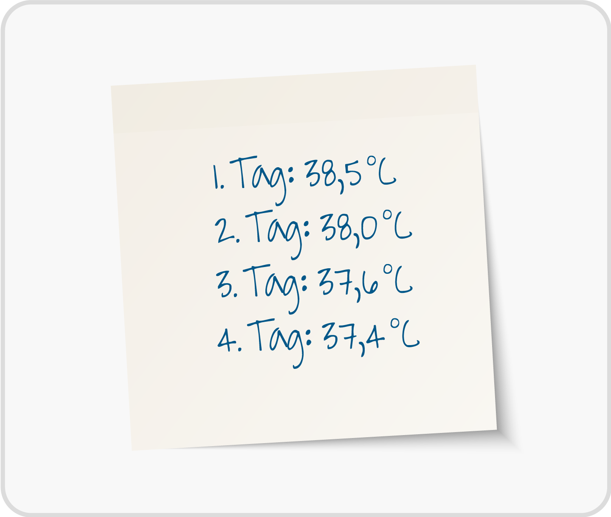
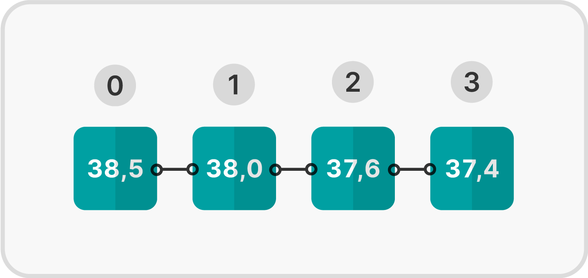

<!--
author:   Tilman Schieber
email:    tilman.schieber@tu-berlin.de
version:  0.0.1
date:     2024
language: de
narrator: Deutsch Female
logo:     img/5/repetition.png
icon:     img/TU_Logo_kurz.svg
comment:  Wir lernen Listen und Sequenzen und wie wir mit der for-Schleife über sie iterieren können.
import:   https://raw.githubusercontent.com/LiaTemplates/Pyodide/master/README.md
import:   https://raw.githubusercontent.com/liaScript/mermaid_template/master/README.md
import:   macros/macros.md
import:   macros/midi.md
link:     styles/main.css

-->

# 5. Listen und Schleifen

<div class="alert summary">

<h4>Lernziele</h4>


In diesem Kapitel lernen Sie, wie Sie mit Auflistungen von Daten umgehen und wie Sie Schleifen verwenden können, um über diese zu iterieren. 

Am Ende können Sie:

1. Listen erstellen und darauf zugreifen
2. Listen als Sequenztypen verstehen
3. Mit der `for`-Schleife über Listen iterieren


</div>

## Wozu Listen?

Im letzten Kapitel [„Wiederholung“](https://liascript.github.io/course/?https://raw.githubusercontent.com/tilman-schieber/OKInf/refs/heads/main/4_Wiederholung.md#2) haben Sie auch die sogenannte Mengenschleife kennengelernt. Dabei wird der Schleifenrumpf für jedes Element einer Auflistung einmal durchgeführt. Typischerweise wird dabei dieses Element gelesen, geschrieben oder beides.

Eine solche Vorgehensweise ist für viele Anwendungen sehr nützlich. Beispielsweise können Sie so 

- Den Durchschnitt einer Liste von Zahlen berechnen
- Die Anzahl der Wörter in einem Text zählen
- Eine Liste von Nachnamen alphabetisch sortieren

Wir verwenden hier den Begriff „Auflistung“, da es sich in den wenigsten Fällen tatsächlich um eine Menge im mathematischen Sinn handelt[^1]


<div class="alert example">	
Nehmen Sie an, bei einem Patienten in einem Krankenhaus wird jeden Morgen die Körpertemperatur gemessen. 
Die Krankenschwester führt eine Liste:

 

Sollen diese Daten nun in einen Computer eingegeben werden, braucht man einen Datentyp, der mehrere Datenelemente enthalten kann[^2].

</div>

<div class="alert definition">	

Skalare und nicht-skalare Datentypen
-------------------------------------

Bei Daten vom Typ `int`, `float` und `boolean` handelt es sich um sogenannte skalare Datentypen. Das bedeutet sie können jeweils einen Wert speichern. Wir benötigen jedoch auch nicht-skalare Datentypen um Konzepte wie eine Liste oder Tabelle im Computer abzubilden. 

Tatsächlich haben wir bereits einige Male nicht-skalare Datentypen verwendet.
Eine Zeichenkette (`str`) ist nichts anderes als eine Auflistung einzelner Buchstaben.

</div>

Eine Liste ist die einfachste Form einer Auflistung in den meisten Programmiersprachen. Sie ermöglicht es, mehrere Werte desselben oder unterschiedlicher Datentypen in einer geordneten Reihenfolge zu speichern. 

Eine Darstellung der Temperaturwerte aus den Notizen der Krankenschwester kann als abstrakte Liste so dargestellt werden:

 

Eine Liste ist indexiert, das bedeutet, dass Sie auf einzelne Elemente in der Liste zugreifen können, indem Sie ihren Index verwenden. Zum Beispiel kann hier auf das erste Element mit dem Index 0, auf das letzte mit dem Index 3 zugegriffen werden.


<div class="alert exercise">

Frage
-----

Welche der folgenden mathematischen Konzepte sind skalaren Werte?

- [[X]] Der Winkel $\alpha$ in einem Dreieck
- [[ ]] Der Vektor $\vec{v} \in \mathbb{R}^3$
- [[ ]] Die Menge der natürlichen Zahlen $\mathbb{N}$
- [[X]] Der Koeffizient $a$ der Parabel $y=ax^2$
- [[ ]] Die Matrix $\begin{pmatrix} 1 & 1 \\ 1 & 1 \end{pmatrix}$

</div>


[^1]: Wie Sie wissen, enthält eine Menge in der Mathematik keine doppelten Elemente. Auflistungen in der Informatik enthalten jedoch häufig ein Element mehrfach.
[^2]: Wir könnten zwar für jeden Tag eine neue Variable anlegen, aber damit wären einfache Operationen wie den Durschnitt oder das Maximum zu berechnen sehr aufwändig.

## Listen in Python

Um eine Liste in Python zu erstellen, definiert man einfach eine Variable, die mehrere Werte enthält. Diese Werte werden in eckige Klammern gesetzt und mit Kommas getrennt.  
In diesem Beispiel speichern wir die täglichen Fiebermessungen eines Patienten in der Variable `fieber`:

```python 
fieber = [37.4, 37.7, 38.4, 38.8]
```
@Pyodide.eval

Auf einzelne Elemente der Liste können wir zugreifen, in dem wir den Index des Elements in eckigen Klammern angeben. Beachten Sie, dass das erste Element den Index „Null“ hat.

`fieber[1]` gibt also das zweite Element zurück. Mit `fieber[0]` erhalten wir das erste Element.

```python 
>>> fieber[1]
37.7

>>> fieber[0]
37.4
```

Die Funktion `len`, kurz für „length“ gibt die Anzahl der Elemente in der Liste aus. In diesem Fall vier:

```python 
>>> len(fieber)
4
```

Eine Liste kann auch leer sein. In diesem Fall schreiben wir einfach `[]`:

```python
leere_liste = []
```

Mit einer `while-Schleife`, die bis zur Länge der Liste läuft, können wir alle Elemente der Liste ausgeben. Dabei erhöhen wir den Index `i` in jedem Schleifendurchlauf um eins. Die Schleife läuft so lange der Index `i` kleiner der Länge der Liste ist [^1]

```python
fieber = [37.4, 37.7, 38.4, 38.8]
i = 0
while i < len(fieber):
  print("Am Tag", i + 1 ,"wurden", fieber[i], "Grad gemessen")
  i += 1
```
@Pyodide.eval

Hier wird die Ausgabe der Tage um eins erhöht, damit die Tage von 1 bis 5 gezählt werden, den `Tag 0` würde nicht unbedingt Sinn machen.


[^1]: Hier müssen Sie wieder aufpassen: zwar ist die Länge der Liste 5, aber der Index des letzten Elements ist 4. Wenn wir den Wert von `fieber[5]` abfragen, erhalten wir einen Fehler.

### Übungen: Listen

<div class="alert exercise">

Notenliste
-----------

Gegeben ist diese Liste mit Noten:


```python
noten = [2.0, 1.7, 2.3, 1.3]
```

---

Was ist die Ausgabe von `noten[2]`?

[[ 2.3 ]]

---

Was ist die Ausgabe von `len(noten)`?

[[ 4 ]]

---

Was ist die Ausgabe von `noten[-1]`?

[[ 1.3 ]]

---

Was ist die Ausgabe von `noten * 2`?

- [(X)] `[2.0, 1.7, 2.3, 1.3, 2.0, 1.7, 2.3, 1.3]`
- [( )] `[4.0, 3.4, 4.6, 2.6]`
- [( )] Es gibt einen Fehler.

---

Was ist die Ausgabe von `noten + 1`?

- [( )] `[3.0, 2.7, 3.3, 2.3]`
- [( )] `[2.0, 1.7, 2.3, 1.3, 1]`
- [(X)] Es gibt einen Fehler.
 
---

Was ist die Ausgabe von `list(10)`

- [( )] `[0, 1, 2, 3, 4, 5, 6, 7, 8, 9]`
- [( )] `[]`
- [(X)] `[10]`

---

Was berechnet der folgende Code?

```python
i = 0
x = 0 

while i < len(noten):
  x += noten[i]  
  i += 1

ergebnis = x / len(noten)

```

- [( )] Die Summe der Noten
- [(X)] Den Durchschnitt der Noten
- [( )] Die Anzahl der Noten


@pyconsole 

*Wenn Sie sich nicht sicher sind, können Sie die Befehle in der Python-Konsole ausprobieren.*


</div>

---

<div class="alert exercise">

Fieberliste 2.0
---------------

Die Fieberliste soll jeweils für eine Woche geführt werden. Der erste Messwert steht also für Montag, der zweite für Dienstag und so weiter.
Verwenden Sie eine zusätzliche Liste mit den Namen der Wochentage.

Passen Sie das Programm so an, dass die Tage mit Namen ausgegeben werden.\
Also z.B.: `Am Montag wurden 37.4 Grad gemessen`


Hier unser Ausgangsprogramm:

```python 
fieber = [37.4, 37.7, 38.4, 38.8]
i = 0
while i < len(fieber):
  print("Am Tag", i + 1 ,"wurden", fieber[i], "Grad gemessen")
  i += 1
```
@Pyodide.eval

---

⭐️ ***Bonus:*** Man spricht von "erhöhter Temperatur" wenn die Temperatur über 37.5 Grad liegt und von Fieber bei über 38 Grad. Geben Sie zusätzlich aus, ob der Patient an einem Tag erhöhte Temperatur oder Fieber hatte.	

</div>


## Listen verändern

Natürlich kann auch ein bereits existierender Wert in einer Liste geändert werden. So weisen wir hier dem letzten Wert der Liste – `fieber[4]` – den neuen Wert 37.5 zu:

```python 
fieber = [37.4, 37.7, 38.4, 38.8]
fieber[3] = 37.5
fieber
```
@Pyodide.eval

Sie sehen, dass an Index 3 nun der neue Wert steht.

Es ist aber nicht möglich, auf einen Index zuzugreifen, der nicht existiert. Um neue Werte hinzuzufügen, können wir  `liste.append(wert)` verwenden. Hier fügen wir der Liste `fieber` den Wert 37.7 hinzu:

```python
fieber.append(37.7)
```


<div class="alert tip">

**Hinweis: Methoden und Funktionen**

Funktionen wie `len()` kennen Sie bereits. Methoden sind spezielle Funktionen, die immer an ein Objekt gebunden sind. 
Sie werden mit einem Punkt an das Objekt angehängt und verwenden dessen Daten.

Hier wird also die Methode `append` mit dem Parameter `37.7` auf die Liste `fieber` angewendet.

Wir werden uns noch genauer mit Methoden beschäftigen, wenn wir Klassen und Objektorientierung behandeln.

Listen und auch Strings haben viele praktische Methoden, können Sie erraten, was im folgenden Code passiert?

```python	
s = "Hallo Welt"
s = s.replace("Welt", "Python")
s = s.upper()
print(s)
```
@Pyodide.eval

</div>


## Datentypen in Listen

In einer Liste können auch verschiedene Datentypen gemischt werden. So können wir zum Beispiel eine Liste mit Zahlen und Zeichenketten erstellen.

Angenommen, in unserer Liste mit Temperaturmessungen, gab es an einem Tag keine Messung. Wir könnten dem letzten Wert der Liste einfach die Zeichenkette „keine Messung“ zuweisen. 

```python 
>>> fieber = [37.4, 37.7, 38.4, 38.8]
>>> fieber[3] = "keine Messung"
>>> fieber
[37.4, 37.7, 38.4, 'keine Messung']
```

Listen können immer eine beliebige Mischung von Datentypen enthalten. Das macht sie sehr flexibel, kann aber auch eine Fehlerquelle sein.


Aber auch eine Liste von Listen ist möglich. Wenn drei Messungen am Tag durchgeführt werden, könnte die Liste für die ersten drei Tage so aussehen:

```python
fieber = [[37.4, 37.7, 38.4], [38.0, 38.5, 39.1], [37.5, 37.6, 37.5]]
montag = fieber[0]
print("Messwerte am Montag: ", montag)

# Hier indizieren wir die Liste Montag
print("Messwert am Montagabend: ", montag[2])

# ... fieber[1] wäre Dienstag, die resultierende Liste indiziern wir mit [2]
print("Messwert am Dienstagabend: ", fieber[1][2])
```
@Pyodide.eval


Listen sind ein sogenannter Sequenztyp und Python bietet zahlreiche eingebaute Funktionen, die auf solchen Sequenztypen operieren.
So lässt sich das Minimum `min`, und auch das Maximum `max` einer liste einfach ermitteln. In diesem Fall also die niedrigste und höchste Temperatur unserer Liste:

```python 
>>> min(fieber)
37.4
>>> max(fieber)
37.8
```

Auch die Summe aller Werte einer Liste ist so schnell berechnet: 
```python 
>>> sum(fieber)
189.8
```
Im Fall unseres Fieber-Beispiels macht das wenig Sinn. Teilen wir aber die Summe durch die Anzahl an Werten, die wir mit `len` ermitteln erhalten wir den Durchschnittswert:

```python 
>>> sum(fieber)/len(fieber)
37.96
```


### ✍️ Aufgabe: Recamán-Folge


Die Recamán-Folge ist eine mathematische Folge, die 1964 von dem kolumbianischen Mathematiker Bernardo Recamán Santos erfunden wurde. Die Folge wird wie folgt definiert:

- $a_0 = 0$
- $a_{n+1} = a_n - n$, falls $a_n - n > 0$ und $a_{n+1}$ noch nicht in der Folge vorkommt
- $a_{n+1} = a_n + n$, sonst

Intuitiv erklärt:

> Man beginnt auf dem Zahlenstrahl bei 0. Nun springt man nacheinander um $1,2,3,4\ldots$ auf dem Zahlenstrahl hin- und her. Man versucht zunächst zurückzuspringen, wenn das Ziel aber schon in der Folge vorkommt (oder $\leq 0$ ist), springt man stattdessen um diese Distanz nach vorne.[^1]

So sind die ersten Elemente der Folge:

$$ 0\\ 0+1=1\\ 1+2=3\\ 3+3=6\\ 6-4=2\\ 2+5=7\\ \ldots$$

Die Folge hat einige interessante Eigenschaften und lässt sich schön visualisieren (siehe oben). Man kann sie auch auf dem Klavier spielen, das klingt dann ungefähr so:

@midi(img/5/recaman.mid)


<div class="alert exercise">

Aufgabe
-------

Programmieren Sie ein Python-Programm, das die ersten 100 Elemente der Recamán-Folge berechnet und ausgibt.

Was ist das 100. Element[^2] der Recamán-Folge? 

[[ 64 ]]

</div>


[^1]: Eine ausführliche Erklärung finden Sie auch in diesem Video (englisch): [The Slightly Spooky Recamán Sequence](https://www.youtube.com/watch?v=FGC5TdIiT9U "The Slightly Spooky Recamán Sequence (Numberphile)")

[^2]: Achtung, das 100. Element hat den Index 99, da die Liste bei 0 beginnt.