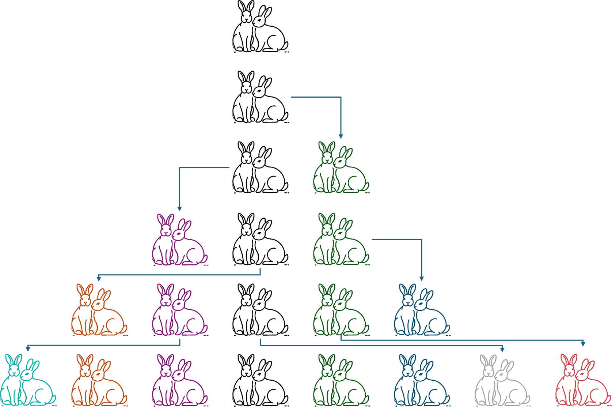
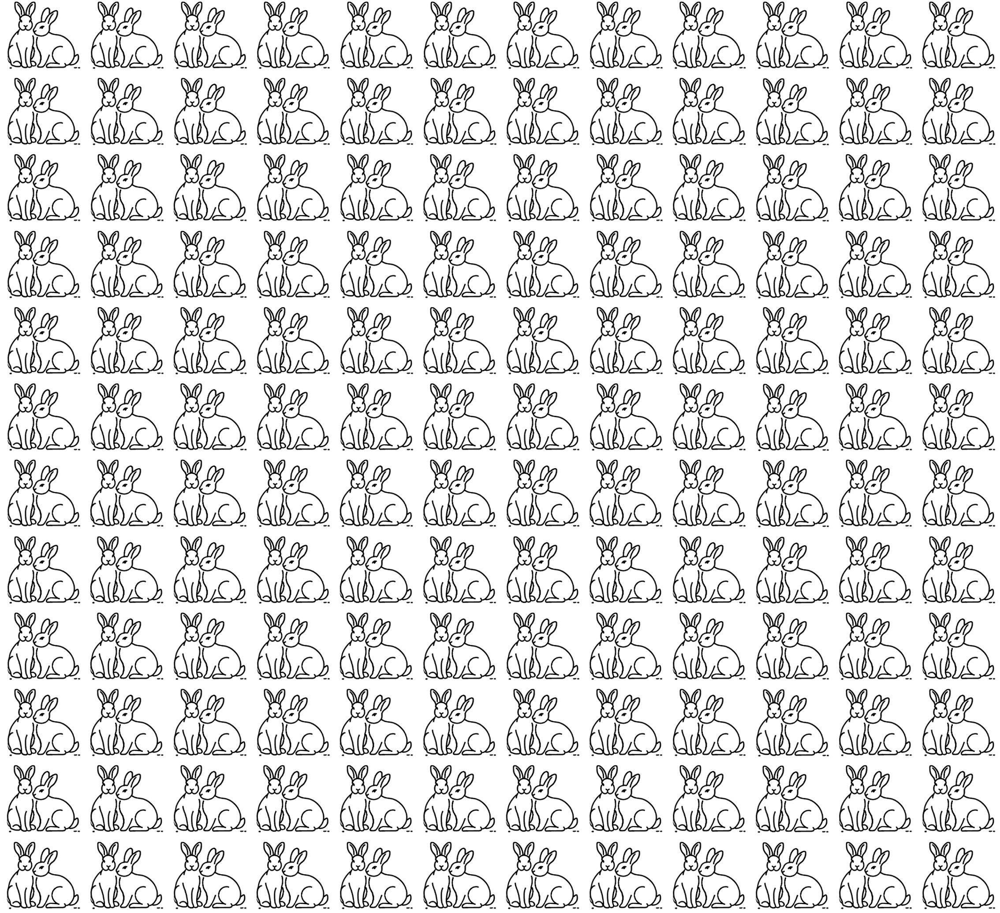
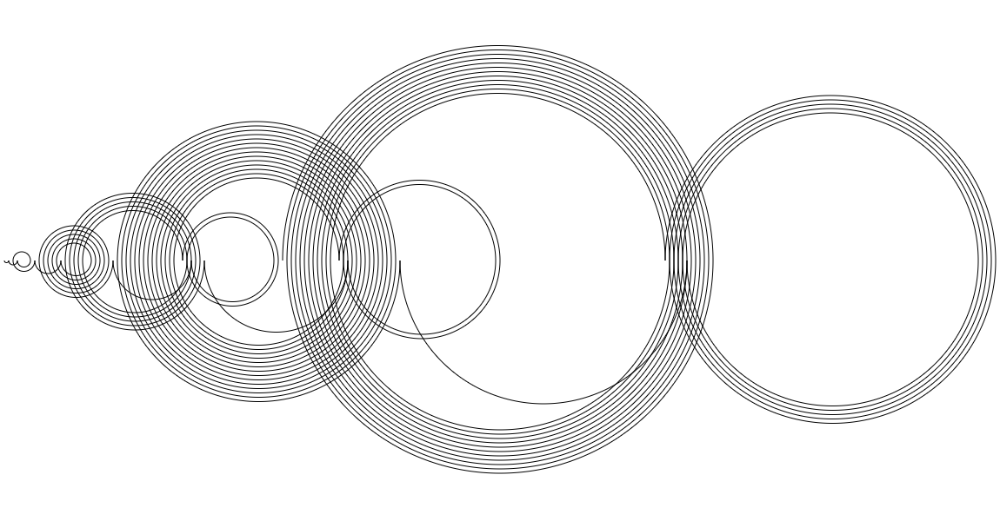

<!--
author:   Tilman Schieber
email:    tilman.schieber@tu-berlin.de
version:  1.0.1
date:     2024
language: de
narrator: Deutsch Female
logo:     img/5/logo_listen.png
icon:     img/TU_Logo_kurz.svg
comment:  Wir lernen Listen und Sequenzen und wie wir mit der for-Schleife über sie iterieren können.
import:   https://raw.githubusercontent.com/LiaTemplates/Pyodide/master/README.md
import:   https://raw.githubusercontent.com/liaScript/mermaid_template/master/README.md
import:   macros/macros.md
import:   macros/midi.md
link:     styles/main.css

-->

# 5. Listen und Schleifen

<div class="flex-container align-center my-4">

<div class="flex-child">


</div>

<div class="flex-child-2 mx-3">

<h4>Lernziele</h4>

In diesem Kapitel lernen Sie, wie Sie mit Auflistungen von Daten umgehen und wie Sie Schleifen verwenden können, um über diese zu iterieren. 

Am Ende können Sie:

1. Listen erstellen und darauf zugreifen
2. Listen als Sequenztypen verstehen
3. Mit der `for`-Schleife über Listen iterieren


</div>

</div>

<!-- class="context"-->
Dieses Kapitel knüpft direkt an das Kapitel @[lialink(Wiederholung)](4_Wiederholung.md) an, indem Sie die `while`-Schleife kennengelernt haben.\
Für den Überblick über den gesamten Kurs kommen Sie 
@[lialink(hier zurück zur Kursübersicht)](0_Inhalt.md).


## Wozu Listen?

Im letzten Kapitel [„Wiederholung“](https://liascript.github.io/course/?https://raw.githubusercontent.com/tilman-schieber/OKInf/refs/heads/main/4_Wiederholung.md#2) haben Sie auch die sogenannte Mengenschleife kennengelernt. Dabei wird der Schleifenrumpf für jedes Element einer Auflistung einmal durchgeführt. Typischerweise wird dabei dieses Element gelesen, geschrieben oder beides.

Eine solche Vorgehensweise ist für viele Anwendungen sehr nützlich. Beispielsweise können Sie so 

- Den Durchschnitt einer Liste von Zahlen berechnen
- Die Anzahl der Wörter in einem Text zählen
- Eine Liste von Nachnamen alphabetisch sortieren

Wir verwenden hier den Begriff „Auflistung“, da es sich in den wenigsten Fällen tatsächlich um eine Menge im mathematischen Sinn handelt[^1]


<div class="alert example">	
Nehmen Sie an, bei einem Patienten in einem Krankenhaus wird jeden Morgen die Körpertemperatur gemessen. 
Die Krankenschwester führt eine Liste:

 

Sollen diese Daten nun in einen Computer eingegeben werden, braucht man einen Datentyp, der mehrere Datenelemente enthalten kann[^2].

</div>

<div class="alert definition">	

Skalare und nicht-skalare Datentypen
-------------------------------------

Bei Daten vom Typ `int`, `float` und `boolean` handelt es sich um sogenannte skalare Datentypen. Das bedeutet sie können jeweils einen Wert speichern. Wir benötigen jedoch auch nicht-skalare Datentypen um Konzepte wie eine Liste oder Tabelle im Computer abzubilden. 

Tatsächlich haben wir bereits einige Male nicht-skalare Datentypen verwendet.
Eine Zeichenkette (`str`) ist nichts anderes als eine Auflistung einzelner Buchstaben.

</div>

Eine Liste ist die einfachste Form einer Auflistung in den meisten Programmiersprachen. Sie ermöglicht es, mehrere Werte desselben oder unterschiedlicher Datentypen in einer geordneten Reihenfolge zu speichern. 

Eine Darstellung der Temperaturwerte aus den Notizen der Krankenschwester kann als abstrakte Liste so dargestellt werden:

 

Eine Liste ist indexiert, das bedeutet, dass Sie auf einzelne Elemente in der Liste zugreifen können, indem Sie ihren Index verwenden. Zum Beispiel kann hier auf das erste Element mit dem Index 0, auf das letzte mit dem Index 3 zugegriffen werden.


<div class="alert exercise">

Frage
-----

Welche der folgenden mathematischen Konzepte sind skalaren Werte?

- [[X]] Der Winkel $\alpha$ in einem Dreieck
- [[ ]] Der Vektor $\vec{v} \in \mathbb{R}^3$
- [[ ]] Die Menge der natürlichen Zahlen $\mathbb{N}$
- [[X]] Der Koeffizient $a$ der Parabel $y=ax^2$
- [[ ]] Die Matrix $\begin{pmatrix} 1 & 1 \\ 1 & 1 \end{pmatrix}$

</div>


[^1]: Wie Sie wissen, enthält eine Menge in der Mathematik keine doppelten Elemente. Auflistungen in der Informatik enthalten jedoch häufig ein Element mehrfach.
[^2]: Wir könnten zwar für jeden Tag eine neue Variable anlegen, aber damit wären einfache Operationen wie den Durschnitt oder das Maximum zu berechnen sehr aufwändig.

## Listen in Python

Um eine Liste in Python zu erstellen, definiert man einfach eine Variable, die mehrere Werte enthält. Diese Werte werden in eckige Klammern gesetzt und mit Kommas getrennt.  
In diesem Beispiel speichern wir die täglichen Fiebermessungen eines Patienten in der Variable `fieber`:

```python 
fieber = [37.4, 37.7, 38.4, 38.8]
```
@Pyodide.eval

Auf einzelne Elemente der Liste können wir zugreifen, in dem wir den Index des Elements in eckigen Klammern angeben. Beachten Sie, dass das erste Element den Index „Null“ hat.

`fieber[1]` gibt also das zweite Element zurück. Mit `fieber[0]` erhalten wir das erste Element.

```python 
>>> fieber[1]
37.7

>>> fieber[0]
37.4
```

Die Funktion `len`, kurz für „length“ gibt die Anzahl der Elemente in der Liste aus. In diesem Fall vier:

```python 
>>> len(fieber)
4
```

Eine Liste kann auch leer sein. In diesem Fall schreiben wir einfach `[]`:

```python
leere_liste = []
```

Mit einer `while-Schleife`, die bis zur Länge der Liste läuft, können wir alle Elemente der Liste ausgeben. Dabei erhöhen wir den Index `i` in jedem Schleifendurchlauf um eins. Die Schleife läuft so lange der Index `i` kleiner der Länge der Liste ist [^1]

```python
fieber = [37.4, 37.7, 38.4, 38.8]
i = 0
while i < len(fieber):
  print("Am Tag", i + 1 ,"wurden", fieber[i], "Grad gemessen")
  i += 1
```
@Pyodide.eval

Hier wird die Ausgabe der Tage um eins erhöht, damit die Tage von 1 bis 5 gezählt werden, den `Tag 0` würde nicht unbedingt Sinn machen.


[^1]: Hier müssen Sie wieder aufpassen: zwar ist die Länge der Liste 5, aber der Index des letzten Elements ist 4. Wenn wir den Wert von `fieber[5]` abfragen, erhalten wir einen Fehler.

### Übungen: Listen

<div class="alert exercise">

Notenliste
-----------

Gegeben ist diese Liste mit Noten:


```python
noten = [2.0, 1.7, 2.3, 1.3]
```

---

Was ist die Ausgabe von `noten[2]`?

[[ 2.3 ]]

---

Was ist die Ausgabe von `len(noten)`?

[[ 4 ]]

---

Was ist die Ausgabe von `noten[-1]`?

[[ 1.3 ]]

---

Was ist die Ausgabe von `noten * 2`?

- [(X)] `[2.0, 1.7, 2.3, 1.3, 2.0, 1.7, 2.3, 1.3]`
- [( )] `[4.0, 3.4, 4.6, 2.6]`
- [( )] Es gibt einen Fehler.

---

Was ist die Ausgabe von `noten + 1`?

- [( )] `[3.0, 2.7, 3.3, 2.3]`
- [( )] `[2.0, 1.7, 2.3, 1.3, 1]`
- [(X)] Es gibt einen Fehler.
 
---

Was ist die Ausgabe von `list(10)`

- [( )] `[0, 1, 2, 3, 4, 5, 6, 7, 8, 9]`
- [( )] `[]`
- [(X)] `[10]`

---

Was berechnet der folgende Code?

```python
i = 0
x = 0 

while i < len(noten):
  x += noten[i]  
  i += 1

ergebnis = x / len(noten)

```

- [( )] Die Summe der Noten
- [(X)] Den Durchschnitt der Noten
- [( )] Die Anzahl der Noten


@pyconsole 

*Wenn Sie sich nicht sicher sind, können Sie die Befehle in der Python-Konsole ausprobieren.*


</div>

---

<div class="alert exercise">

Fieberliste 2.0
---------------

Die Fieberliste soll jeweils für eine Woche geführt werden. Der erste Messwert steht also für Montag, der zweite für Dienstag und so weiter.
Verwenden Sie eine zusätzliche Liste mit den Namen der Wochentage.

Passen Sie das Programm so an, dass die Tage mit Namen ausgegeben werden.\
Also z.B.: `Am Montag wurden 37.4 Grad gemessen`


Hier unser Ausgangsprogramm:

```python 
fieber = [37.4, 37.7, 38.4, 38.8]
i = 0
while i < len(fieber):
  print("Am Tag", i + 1 ,"wurden", fieber[i], "Grad gemessen")
  i += 1
```
@Pyodide.eval

---

⭐️ ***Bonus:*** Man spricht von "erhöhter Temperatur" wenn die Temperatur über 37.5 Grad liegt und von Fieber bei über 38 Grad. Geben Sie zusätzlich aus, ob der Patient an einem Tag erhöhte Temperatur oder Fieber hatte.	

</div>


## Listen verändern

Natürlich kann auch ein bereits existierender Wert in einer Liste geändert werden. So weisen wir hier dem letzten Wert der Liste – `fieber[4]` – den neuen Wert 37.5 zu:

```python 
fieber = [37.4, 37.7, 38.4, 38.8]
fieber[3] = 37.5
fieber
```
@Pyodide.eval

Sie sehen, dass an Index 3 nun der neue Wert steht.

Es ist aber nicht möglich, auf einen Index zuzugreifen, der nicht existiert. Um neue Werte hinzuzufügen, können wir  `liste.append(wert)` verwenden. Hier fügen wir der Liste `fieber` den Wert 37.7 hinzu:

```python
fieber.append(37.7)
```

<div class="alert tip">

**Hinweis: Methoden und Funktionen**

Funktionen wie `len()` kennen Sie bereits. Methoden sind spezielle Funktionen, die immer an ein Objekt gebunden sind. 
Sie werden mit einem Punkt an das Objekt angehängt und verwenden dessen Daten.

Hier wird also die Methode `append` mit dem Parameter `37.7` auf die Liste `fieber` angewendet.

Wir werden uns noch genauer mit Methoden beschäftigen, wenn wir Klassen und Objektorientierung behandeln.

Listen und auch Strings haben viele praktische Methoden, können Sie erraten, was im folgenden Code passiert?

```python	
s = "Hallo Welt"
s = s.replace("Welt", "Python")
s = s.upper()
print(s)
```
@Pyodide.eval

</div>

Auch das Entfernen von Werten ist möglich. Mit `liste.pop(index)` entfernen wir den Wert an der Stelle `index` und geben ihn zurück. Ohne Parameter wird einfach der letzte Wert entfernt:

```python
fieber = [37.4, 37.7, 38.4, 38.8]
print("Wert an Index 1:",fieber.pop(1))
print("Letzter Wert:", fieber.pop())
print("Die Liste nach Entfernen:", fieber)
```
@Pyodide.eval

Wenn Sie einen bestimmten Wert entfernen wollen und nicht wissen, an welcher Stelle er steht, können Sie `liste.remove(wert)` verwenden. 

```python
freunde = ["Ivan", "Michael", "Andrea", "Lena"]
freunde.remove("Michael")
freunde
```
@Pyodide.eval

<div class="alert exercise">

Übung
-----

Was ist die Ausgabe des folgenden Codes?

```python
zahlen = [1, 1, 2, 3, 5 ,8, 13]
zahlen.pop()
zahlen.remove(1)
print(zahlen.pop(1))
```

[[ 2 ]]

</div>


## Datentypen in Listen

In einer Liste können auch verschiedene Datentypen gemischt werden. So können wir zum Beispiel eine Liste mit Zahlen und Zeichenketten erstellen.

Angenommen, in unserer Liste mit Temperaturmessungen, gab es an einem Tag keine Messung. Wir könnten dem letzten Wert der Liste einfach die Zeichenkette „keine Messung“ zuweisen. 

```python 
fieber = [37.4, 37.7, 38.4, 38.8]
fieber[3] = "keine Messung"
fieber
```
@Pyodide.eval

Listen können immer eine beliebige Mischung von Datentypen enthalten. Das macht sie sehr flexibel, kann aber auch eine Fehlerquelle sein.

Aber auch eine Liste von Listen ist möglich. Wenn drei Messungen am Tag durchgeführt werden, könnte die Liste für die ersten drei Tage so aussehen:

```python
fieber = [[37.4, 37.7, 38.4], [38.0, 38.5, 39.1], [37.5, 37.6, 37.5]]
montag = fieber[0]
print("Messwerte am Montag: ", montag)

# Hier indizieren wir die Liste Montag
print("Messwert am Montagabend: ", montag[2])

# ... fieber[1] wäre Dienstag, die resultierende Liste indizieren wir mit [2]
print("Messwert am Dienstagabend: ", fieber[1][2])
```
@Pyodide.eval

## Listen als Sequenztyp

Listen sind ein sogenannter Sequenztyp.

Sequenztypen sind 

1. nicht-skalar
2. Die ELemente haben eine feste Reihenfolge

Einen anderen Sequenztyp haben Sie mit Strings bereits kennengelernt.
Auch sie bestehen aus mehreren Zeichen (nicht-skalar), die eine feste Reihenfolge haben.

Alle Sequenztypen unterstützen folgende Operationen:

* **Verkettung:** Sie können mit `seq + seq` aneinandergefügt werden
* **Wiederholung:** Sie können mit `seq * n` aneinandergefügt werden
* **Indizierung:** Mit dem Operator `seq[n]` erhalten wir das n-te Element. (Vorsicht! Man zählt immer ab Null). Negatives n indiziert vom Ende der Liste.
* **Slicing:** Eine kompliziertere Art der Indizierung, `seq[a:b]` gibt eine Teilsequenz vom `a`-ten bis zum `b`-ten Element zurück (das `b`-te Element ist nicht enthalten).
* **Test auf Mitgliedschaft:** `i in seq` ist wahr wenn `i` in der Sequenz enthalten ist
* **Funktionen:** Eine Vielzahl von Funktionen operiert auf Sequenzen:

  * `len(seq)` kennen Sie bereits: die Länge der Sequenz
  * `min(seq)` der kleinste Wert der Sequenz
  * `max(seq)` der größte Wert der Sequenz

und schließlich die

* **Iteration:** `for i in seq`: führt einen Codeblock mit jedem Element der Sequenz aus.[^1]

[^1]: Das ist eine neue Art der Schleife, die Mengenschleife, die wir in diesem Kapitel gleich noch ausführlicher betrachten werden.


### Verkettung und Wiederholung

Die Operatoren `+` und `*` können auch auf Sequenzen angewendet werden. 

- `+` fügt zwei Sequenzen zusammen
- `* n` wiederholt eine Sequenz n-mal

Hier sehen sie ein Beispiel mit Strings:

```python
linie = '-' * 20
print(linie * 3)
print(linie + "Herzlich Willkommen!" + linie)
print(linie * 3)
```
@Pyodide.eval

<div class="alert exercise">

Frage
-----

Was ist die Ausgabe des folgenden Codes?

```python
l1 = [1, 2, 3]
l2 = [4, 5, 6]
l3 = l1 * 2 + l2 + l1 * 2 
print(l3[7])
```

[[ 5 ]]

</div>


### Indizierung und Slicing

Die Indizierung haben Sie bereits kennengelernt, mit `seq[n]` erhalten Sie das n-te Element einer Sequenz:

Beispiel
--------

Wir betrachten die Liste `lst = [1, 2, 4, 8, 16, 32]`:

* `lst[0]` – das erste Element `1`
* `lst[5]` – das 6. Element, `32`
* `lst[-1]` – das letzte Element, `32`
* `lst[-2]` – das vorletzte Element, `16`

eine etwas komplexere Variante davon ist das sogenannte *Slicing*. Hiermit können Sie eine Teilsequenz einer Liste extrahieren:

* `lst[0:2]` – die ersten zwei Elemente `[1, 2]`.
* `lst[:2]` – ebenfalls `[1, 2]`  Beginnt das *slice* bei 0 kann die Zahl weggelassen werden.
* `lst[3:6]` – `[8, 16, 32]`, die Elemente an Position 3,4 und 5
* `lst[3:]` – ebenfalls `[8, 16, 32]`,  die Elemente von Position 3 bis zum Ende der Liste
* `lst[1:3]` – `[2, 4]`, die Elemente an Position 1 und 2
* `lst[::2]` – `[1, 4, 16]`, jedes zweite Element
* `lst [::-1]` – `[32, 16, 8, 4, 2, 1]`, die Liste rückwärts

*Slicing* ist auf den ersten Blick schwer zu verstehen, am besten versuchen sie die Funktionsweise hier selbst nachzuvollziehen:

Wählen Sie durch Klicken Elemente der Liste aus. Darunter wird Ihnen dann angezeigt, wie Sie diesen Teil der Liste extrahieren können.

@[embed(style="height: 400px; width:600px; border: none")](html/5/listslicer.html)

---

<div class="alert exercise">

Übung
-----

Da Strings ebenfalls Sequenzen sind, funktioniert Slicing ganz genauso:

```python
s = "Donaudampfschiffahrtsgesellschaftskapitän"
```

Was ist die Ausgabe von...

`s[0:5]`
- [( )] `onau`
- [(X)] `Donau`
- [( )] `Donaud`


`s[-3:-6:-1]`
- [(X)] `tip`
- [( )] `pit`
- [( )] `uan`


`s[-7::-1]`
- [( )]  'nätipak'
- [(X)]  'kapitän'
- [( )]  'stfahcs'


</div>


### Funktionen auf Sequenzen

Python bietet zahlreiche eingebaute Funktionen, die auf solchen Sequenztypen operieren.
So lässt sich das Minimum `min`, und auch das Maximum `max` einer Liste einfach ermitteln.

Wir kehren zu unserem Fieber-Beispiel zurück.
So finden wir einfach die niedrigste und höchste Temperatur unserer Liste:

```python
fieber = [37.4, 37.7, 38.4, 38.8]
print("Minimum:",min(fieber))
print("Maximum:",max(fieber))
```
@Pyodide.eval

Auch die Summe lässt sich einfach mit der Funktion `sum` berechnen. Im Fall unseres Fieber-Beispiels macht das wenig Sinn. Teilen wir aber die Summe durch die Anzahl an Werten, die wir mit `len` ermitteln erhalten wir den Durchschnittswert:

```python 
fieber = [37.4, 37.7, 38.4, 38.8]
sum(fieber)/len(fieber)
```
@Pyodide.eval

<div class="alert exercise">

Frage
-----

Können Sie erraten was `min("Python")` und `max("Python")` ausgeben?

- [( )] `min` ist `P` und `max` ist `n`
- [(X)] `min` ist `P` und `max` ist `y`
- [( )] `min` ist `o` und `max` ist `P`
- [( )] `min` ist `y` und `max` ist `n`
*************************
Die Buchstaben in Python werden nach ihrem Zeichencode sortiert. Da die Großbuchstaben vor den Kleinbuchstaben kommen, ist `P` das Minimum und `y` das Maximum.
*************************


</div>

## die for-Schleife

Wir haben bereits Zähl- und Bedinguungsschleifen kennengelernt. Die Mengenschleife wird in Python mit dem Schlüsselwort `for` eingeleitet. Sie wird verwendet, um über eine Sequenz zu iterieren, also einen Codeblock für jedes Element einer Sequenz auszuführen.

Die Syntax ist:

```python
for element in sequenz:
  # Codeblock
```

Erinnern Sie sich daran, wie wir mit der `while`-Schleife über eine Liste iteriert haben? Das geht mit der `for`-Schleife viel einfacher.

Hier ist unser Beispiel mit der Fieberliste. 
Um alle Temperaturen auszugeben, schreiben wir einfach:

```python 
fieber = [37.4, 37.7, 38.4, 38.8]
for temperatur in fieber:
  print(temperatur)
```
@Pyodide.eval

Auch eine neue Liste, die alle Temperaturen in Fahrenheit enthält, lässt sich so einfach erstellen:

```python 
fieber = [37.4, 37.7, 38.4, 38.8]
fieber_fahrenheit = []
for temperatur in fieber:
  fahrenheit = temperatur * 9/5 + 32
  fieber_fahrenheit.append(fahrenheit)
fieber_fahrenheit
```
@Pyodide.eval

<div class="alert exercise">

Aufgabe
-------

Im folgenden Programmcode wird eine Liste von Zahlen definiert.

Berechnen Sie die Summe aller positiven Zahlen.

```python 
zahlen = [-7, -42, 63, 18, -55, -91, 29, 10, 84, -6, 77, -30, -12, 47, 52, -8, 15, -23, 66, -19, 32, -18, 7, -54, 91, -63, -29, 45, -6, -77, 23, -10, 12, -47, -52, 8, -15, 36, 19, -66]

# fügen Sie hier Ihren Code ein


print(summe)
```
@Pyodide.eval

Die Summe aller positiven Zahlen beträgt  

[[ 734 ]]

</div>

### Zählschleifen mit for

Da die `for`-Schleife in Python sehr einfach zu verwenden ist, werden mit ihr auch oft Zählschleifen realisiert. 

Da `for` immer über eine Sequenz iteriert, brauchen wir nur eine Sequenz von Zahlen.
Die Hilfsfunktion `range()` erzeugt eine Teilmenge von Ganzzahlen, über die die Schleife iteriert: 

<div class="alert definition">

`range`-Funktion
-----------------

* `range(n)` erzeugt eine Sequenz von Ganzzahlen von  `0 ` bis  `(n-1) `. 
* `range(start, stop)` erzeugt eine Sequenz von Ganzzahlen von  `start` bis  `(stop-1)`.
* `range(start, stop, step)` erzeugt eine Sequenz von Ganzzahlen von  `start` bis  `(stop-1)` mit dem Abstand `step`

</div>

Beispiel
--------

* `range(6)` erzeugt die Sequenz `(0, 1, 2, 3, 4, 5)`.  
* `range(1, 6)` erzeugt die Sequenz `(1, 2, 3, 4, 5)`.  
* `range(1, 6, 2)` erzeugt die Sequenz `(1, 3, 5)`.  

Erinnern Sie sich an unsere Implementierung von $n!$, der Fakultät?  
Mit Hilfe der `range` Funktion lässt sich das auch einfach und elegant mit einer `for`-Schleife schreiben:

```python
n = 5
fak = 1
for i in range(1, n + 1):
    fak *= i
print("5! =", fak)
```
@Pyodide.eval

<div class="alert exercise">

Aufgabe
-------

Berechnen Sie die Summe der ersten hundert Quadratzahlen

$$
\sum_{i=1}^{100} i^2
$$

```python 

# Benutzen Sie eine for-Schleife und die Funktion range.
# fügen Sie hier Ihren Code ein!


```
@Pyodide.eval

Die Summe beträgt

[[ 338350 ]]
*************************

```python
summe = 0
for i in range(1,101):
	summe += i ** 2
print(summe)
```
@Pyodide.eval

*************************

</div>

### ✍️ Aufgabe: Fibonacci-Zahlen

Die Fibonacci-Zahlen sind eine Folge von Zahlen, die nach dem italienischen Mathematiker Leonardo Fibonacci benannt sind. 

Er stellte sich die folgende Frage[^1]:

> Wie viele Paare von Kaninchen gibt es nach einem Jahr, wenn jedes Paar nach einem Monat ein neues Paar bekommt?

<div class="flex-container">

<div class="flex-child">



</div>

<div class="flex-child ">

* im ersten Monat: 1 Paar
* im zweiten Monat: 1 Paar (erst nach einem Monat sind Kaninchen geschlechtsreif)
* im dritten Monat: 2 Paare (das erste Paar bekommt Nachwuchs)
* im vierten Monat: 3 Paare (das erste Paar bekommt Nachwuchs)
* im fünften Monat: 5 Paare (das erste und das zweite Paar bekommen Nachwuchs)
* im sechsten Monat: 8 Paare (alle drei Paare bekommen Nachwuchs)

</div>
</div>

Die Folge beginnt mit den Zahlen 0 und 1, und jedes nachfolgende Element ist die Summe der beiden vorherigen Elemente:

$$fib(1) = 1\\
fib(2) = 1\\
fib(n) = fib(n-1) + fib(n-2)$$

Die ersten Elemente der Fibonacci-Folge sind also:


<div class="center">

$1, 1, 2, 3, 5, 8, 13, 21, 34, 55, 89, 144, \ldots$

<!--style="max-width:400px" -->

Nach 12 Monaten sind es 144 Kaninchenpaare!

</div>

<div class="alert exercise">

Aufgabe
-------

Programmieren Sie ein Programm, das mit der Liste `fib = [1, 1]` beginnt, die ersten 100 Fibonacci-Zahlen berechnet und an die Liste anhängt.

Was ist die 100. Fibonacci-Zahl?

[[ 354224848179261915075 ]]
[[?]] Achtung: Die erste Fibonacci-Zahl ist `fib[0]`, die 100. Fibonacci-Zahl ist `fib[99]`.


</div>


[^1]:

### ✍️ Aufgabe: Recamán-Folge



Die Recamán-Folge ist eine mathematische Folge, die 1964 von dem kolumbianischen Mathematiker Bernardo Recamán Santos erfunden wurde. Die Folge wird wie folgt definiert:


<div class="alert definition">

Definition: Recamán-Folge
--------------------------

- $a_0 = 0$
- $a_{n+1} = a_n - n$, falls $a_n - n > 0$ und $a_{n+1}$ noch nicht in der Folge vorkommt
- $a_{n+1} = a_n + n$, sonst

</div>

Intuitiv erklärt:

> Man beginnt auf dem Zahlenstrahl bei 0. Nun springt man nacheinander um $1,2,3,4\ldots$ auf dem Zahlenstrahl hin- und her. Man versucht zunächst zurückzuspringen, wenn das Ziel aber schon in der Folge vorkommt (oder $\leq 0$ ist), springt man stattdessen um diese Distanz nach vorne.[^1]

So sind die ersten Elemente der Folge:

$$ 0\\ 0+1=1\\ 1+2=3\\ 3+3=6\\ 6-4=2\\ 2+5=7\\ \ldots$$

Die Folge hat einige interessante Eigenschaften und lässt sich schön visualisieren (siehe oben). Man kann sie auch auf dem Klavier spielen, das klingt dann ungefähr so:

@midi(img/5/recaman.mid)


<div class="alert exercise">

Aufgabe
-------

Programmieren Sie ein Python-Programm, das die ersten 100 Elemente der Recamán-Folge berechnet und ausgibt.

Was ist das 100. Element[^2] der Recamán-Folge? 

[[ 64 ]]

</div>


[^1]: Eine ausführliche Erklärung finden Sie auch in diesem Video (englisch): [The Slightly Spooky Recamán Sequence](https://www.youtube.com/watch?v=FGC5TdIiT9U "The Slightly Spooky Recamán Sequence (Numberphile)")

[^2]: Achtung, das 100. Element hat den Index 99, da die Liste bei 0 beginnt.

### ✍️ Aufgabe: Das Sieb des Erathostenes

Das Sieb des Eratosthenes ist ein Algorithmus, um alle Primzahlen bis zu einer gegebenen Zahl $n$ zu finden. Der Algorithmus funktioniert wie folgt:

<div class="alert definition">

Sieb des Eratosthenes
----------------------

1. Erstelle eine Liste aller Zahlen von 2 bis $n$.
2. Beginne mit der ersten noch nicht gestrichenen Zahl in der Liste und streiche alle Vielfachen dieser Zahl aus der Liste.
3. Gehe zur nächsten ungestrichenen Zahl in der Liste. Ist sie kleiner als $\sqrt{n}$ wiederhole den Schritt 2.
4. Alle nicht gestrichenen Zahlen auf der Liste sind Primzahlen.

</div>

Hier sehen Sie, wie schnell man so alle Primzahlen bis 100 findet:

@[embed(style="height: 650px; width:600px; border: none")](html/5/erathostenes.html)


<div class="alert exercise">

Aufgabe
-------

Setzen Sie den Algorithmus in Python um. Berechnen Sie alle Primzahlen unter einer Million ($10^6$).

Überlegen Sie sich zunächst wie Sie das "aus der Liste streichen" implementieren wollen.
Hier zwei Ideen:

1. Erstellen Sie eine Liste aller Zahlen von 2-1000000. Um eine Zahl zu streichen, setzen Sie den Wert auf 0.

2. Erstellen Sie eine Liste mit einer Million `True`-Werten. Um eine Zahl zu streichen, setzen Sie den entsprechenden Wert der Liste auf `False`. 


Was ist die größte Primzahl kleiner als eine Million?
  
  [[ 999983 ]]
  [[?]] 

</div>
