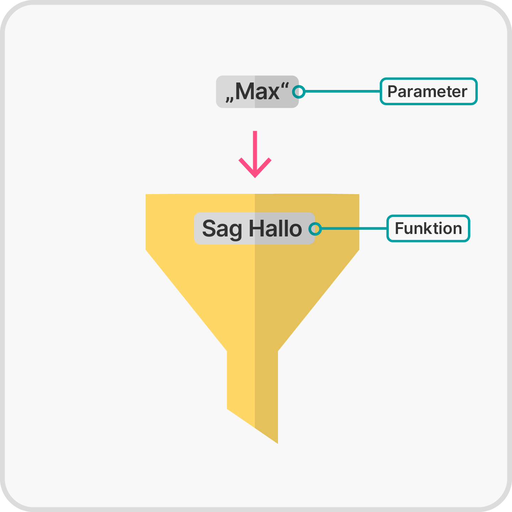
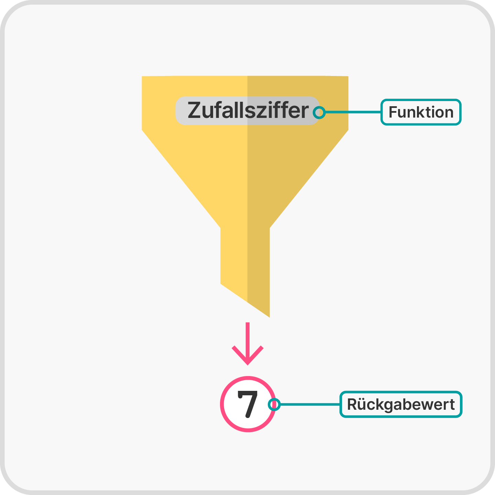
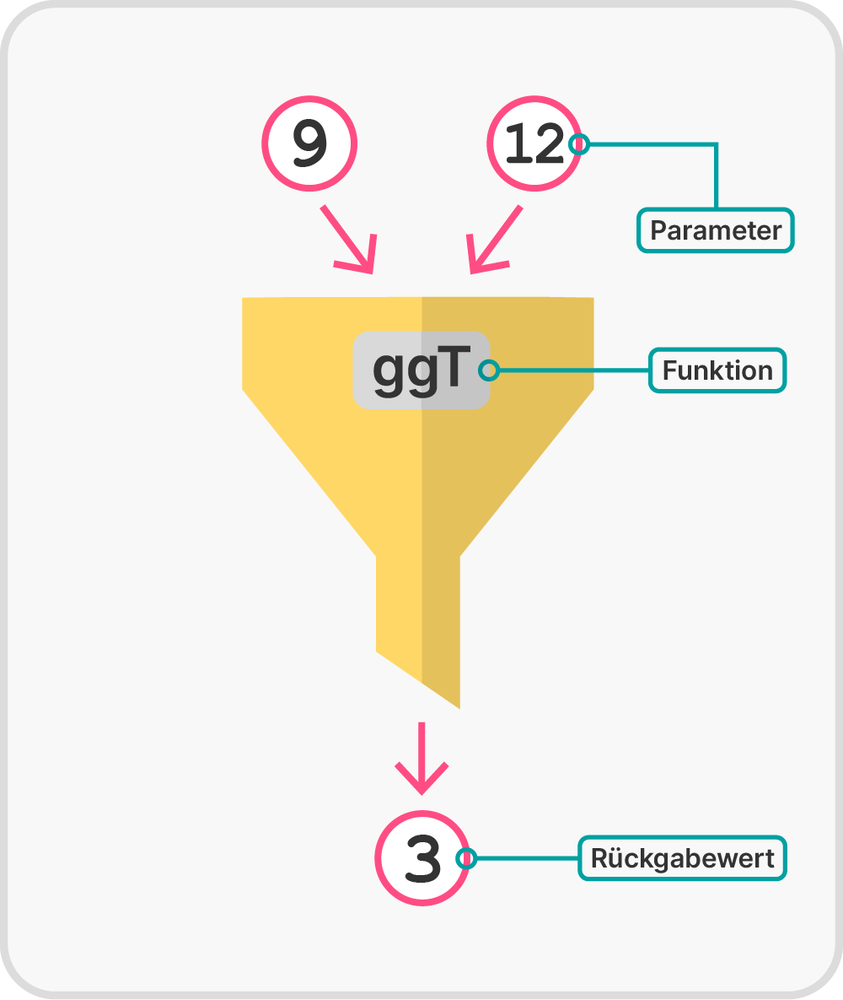

<!--
author:   Tilman Schieber
email:    tilman.schieber@tu-berlin.de
version:  0.0.1
date:     2024
language: de
narrator: Deutsch Female
logo:     img/6/bicycle.png
icon:     img/TU_Logo_kurz.svg
comment:  Wir lernen Listen und Sequenzen und wie wir mit der for-Schleife über sie iterieren können.
import:   https://raw.githubusercontent.com/LiaTemplates/Pyodide/master/README.md
import:   https://raw.githubusercontent.com/liaScript/mermaid_template/master/README.md
import:   macros/macros.md
import:   macros/midi.md
link:     styles/main.css

-->

# Funktionen

<div class="flex-container align-center my-4">

<div class="flex-child">


</div>

<div class="flex-child-2 mx-3">

<h4>Lernziele</h4>

TODO

</div>

</div>

<!-- class="context"-->
Für den Überblick über den gesamten Kurs kommen Sie @[lialink(hier zurück zur Kursübersicht)](0_Inhalt.md).


## Was sind Funktionen?

In der Informatik ist eine Funktion eine Abfolge von Anweisungen, die zu einer Einheit zusammengefasst werden. Diese Einheit bekommt meist einen Namen, und kann dann erneut ausgeführt werden.


<div class="alert warning">

Achtung
-------

Der Begriff Funktion in der Mathematik ist nicht deckungsgleich mit dem Begriff der Funktion in der Informatik. Allerdings lassen sich viele mathematische Funktionen auch als Funktion im Sinne der Informatik definieren.

Zusätzlich wird in der Programmierung auch manchmal der Name Prozedur oder Unterprogramm verwendet. Alle diese Konstrukte nennen wir hier allgemein "Funktion".

</div>


Eine Funktion hat meistens *Parameter*. Das sind Werte, die der Funktion bei jedem Aufruf übergeben werden. Man gibt den oder die Parameter in Klammern hinter dem Funktionsnamen an. Wie in der Mathematik schreiben wir eine Funktion $f$ mit den Parametern $p_0,\ldots,p_n$ als

$$ f(p_0,\ldots,p_n) $$


<div class="flex-container align-center my-4">

<div class="flex-child">

<!--style="max-width:320px" -->

</div>

<div class="flex-child-2 mx-3">


Beispiel
---------

Die Funktion `SagHallo` hat den Parameter Name. Wird z.B. “Max” als Name übergeben, so gibt sie “Hallo Max” auf dem Bildschirm aus. Aufgerufen wird sie mit 

```python
SagHallo("Max")
```


</div>

</div>


Diese Funktion nimmt also einen Parameter und führt abhängig davon etwas aus. Je nachdem, welcher Name übergeben wurde, wird dieser auf dem Bildschirm ausgegeben.

Funktionen können aber auch einen Rückgabewert haben:


<div class="flex-container align-center my-4">

<div class="flex-child">


<!--style="max-width:320px" -->

</div>

<div class="flex-child-2 mx-3">

Beispiel
--------

Die Funktion `Zufallsziffer` nimmt keinen Parameter.
Sie gibt bei jedem Aufruf eine zufällige Ziffer zwischen 0 und 9 zurück. 
Der Aufruf `Zufallsziffer()` gibt also z.B. 3 zurück. 

</div>

</div>

Häufig haben Funktionen sowohl Parameter als auch einen Rückgabewert.
Die Beschreibung von Funktionsname, Parametern und dem Rückgabewert nennt man auch die Signatur einer Funktion:

$$
f(p_0,\ldots,p_n) \rightarrow r
$$

<div class="alert tip">

Hinweis
-------

Eine Signatur kann auch den Datentyp von Parametern und Rückgabewert nennen. Da das in Python aber optional ist, verzichten wir an dieser Stelle darauf.

</div>


<div class="flex-container align-center my-4">

<div class="flex-child">

<!--style="max-width:320px" -->

</div>

<div class="flex-child-2 mx-3">

Beispiel
--------

So können Sie sich eine Funktion, die den größten gemeinsamen Teiler (ggT) zweiter Zahlen berechnet wie einen Trichter vorstellen, in den zwei Zahlen hineingegeben werden und der ggT herauskommt:

Diese Funktion nimmt zwei Zahlen als Parameter und gibt den ggT aus.
Dabei müssen wir nicht wissen, wie diese Funktion den ggT berechnet, um sie benutzen zu können.
Die Signatur dieser Funktion ist dann
$$ ggT(a,b)\rightarrow t $$

</div>

</div>


<div class="alert warning">

Vorsicht vor Nebeneffekten!
---------------------------

Die Funktion `SagHallo`, die eine Begrüßung auf dem Bildschirm ausgibt, hat keinen Rückgabewert. Die Bildschirmausgabe ist ein sogenannter Nebeneffekt. Da man Nebeneffekte nicht an der Signatur einer Funktion erkennen kann, können sie unvorhergesehene Auswirkungen haben. Es gibt einen Programmierstil, die funktionale Programmierung, bei der versucht wird, Funktionen möglichst frei von Nebeneffekten zu halten. Da Ein- und Ausgabe immer Nebeneffekte sind, kann aber nicht ganz darauf verzichtet werden.

</div>

<div class="alert exercise">

Frage
-----

Was ist die Signatur der Funktion *fak*, die die Fakultät $k!$ des Parameters $k$ berechnet?


[( )] $\text{fak}() \to k$
[( )] $\text{fak}(k)$
[( )] $\text{fak}(x, y) \to k$
[(x)] $\text{fak}(k) \to r$
***************************************
Die Funktion hat einen Parameter $k$ und gibt den Wert $r$ zurück.
***************************************
</div>

## Warum Funktionen?

Funktionen sind nicht notwendig, um Programme zu schreiben. Dennoch sind sie aus der Programmierung nicht wegzudenken.

Eine der wichtigsten Ideen in der Informatik ist es, aus den einfachsten Grundbausteinen komplexe Daten und komplexes Verhalten aufzubauen. 
Funktionen erlauben uns auf der Ebene der Programmierung benötigtes Verhalten zu organisieren und wiederzuverwenden. Das vermeidet Redundanz und erlaubt es, bereits implementiertes Verhalten wiederzuverwenden – auch in anderen Programmen.

<div class="alert tip">

Was ist Redundanz?
-------------------

Redundanz bedeutet, dass gleiches oder ähnliches Verhalten mehrfach implementiert wird. In der Programmierung sollte Redundanz wenn möglich vermieden werden.  
Im englischen Sprachraum spricht man auch vom *DRY* Prinzip:\
*DRY* steht für *“Don’t repeat yourself”* – "wiederhole Dich nicht".

</div>

Die Modularisierung mit Funktionen führt noch zu einer Reihe weiterer Vorteile. Hat man einmal die gewünschte Funktionsweise und die Schnittstellen einer Funktion definiert, interessiert den Anwender der Funktion deren interne Funktionsweise nicht mehr. 

Dieses Prinzip nennt man auch *Black-Box Abstraktion*: Eine Funktion wird als eine undurchsichtige Kiste (*black box*) gesehen, deren innere Funktionsweise vom Nutzer nicht gesehen werden kann oder muss. 

Einige der Vorteile sind:

1. **Arbeitserleichterung beim Programmieren:** Ist eine Funktion einmal programmiert worden, kann sie beliebig oft wiederverwendet werden. Auch in anderen Programmen und Kontexten.
2. **Modularität:** Die Implementierung einer Funktion kann verändert werden, ohne den Code, der sie nutzt, zu ändern. Implementieren Sie beispielsweise einen neuen schnellen Algorithmus, um den ggT zu berechnen, profitiert Code, der diese Funktion nutzt, automatisch von der verbesserten Leistung, ohne dass Anpassungen erforderlich sind.
3. **Bessere Teamarbeit:** Gemeinsames Programmieren wird vereinfacht, wenn die
Signaturen von Funktionen festgelegt werden und so Programmieraufgaben an Andere delegiert werden können.


<div class="alert exercise">

Aufgabe
-------

Fügen Sie folgende Begriffe in den Lückentext ein:
*Schnittstelle -- Modularität -- Black-Box -- Redundanz*

Die Verwendung von Funktionen fördert die [[Modularität]], da einmal definierte Funktionalitäten in verschiedenen Teilen eines Programms oder sogar in unterschiedlichen Projekten wiederverwendet werden können. Das vermeidet die sogenannte [[Redundanz]], die mehrfache Verwendung von gleichem oder ähnlichem Code.
Das Konzept der [[Black-Box]]-Abstraktion ermöglicht es, dass die interne Funktionsweise einer Funktion für den Anwender irrelevant wird, solange die [[Schnittstelle]]
der Funktion klar definiert ist.

</div>