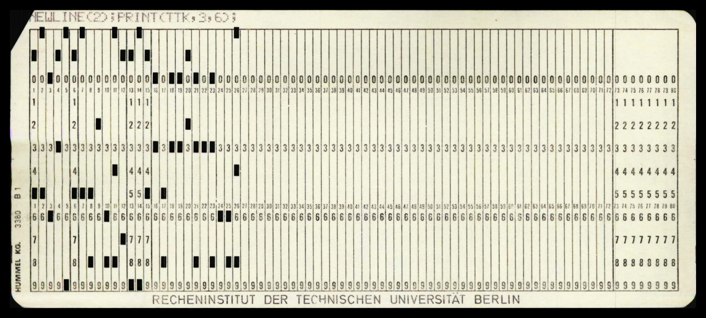

<!--
author:   Tilman Schieber
email:    tilman.schieber@tu-berlin.de
version:  0.0.1
date:     2024
language: de
narrator: Deutsch Female
logo:     img/A/linux.png
icon:     img/TU_Logo_kurz.png
comment:  Eine kurze Einführung in Linux
import:   ./macros.md
link:     styles/main.css
-->

# Eine kurze Einführung in Linux
@[asciinema](cast/test.cast)

## Was ist ein Betriebssystem?

")

***Was ist die Aufgabe der Personen auf diesem Bild?***

*Hardwaretechniker?*\
*Programmierer?*\
*Wissenschaftler?*\


Tatsächlich ist nichts davon richtig. Die Personen auf diesem Bild sind sogenannte *Operator*, die die Computer bedienen. 
Ihre Rolle besteht darin, Programme zu laden, deren Ausführung zu überwachen und sicherzustellen, dass die Computer effizient arbeiten. In den Anfangstagen der Computertechnologie mussten Programme direkt in die Hardware geladen werden, was bedeutete, dass alle Programme direkt eine bestimmte Hardware ansprachen.


<div class="alert alert-yellow">

<!-- class="lead" -->
**Programme laden im Jahr 1970**

---

Der *Operator* erhält einen Stapel mit Lochkarten vom Programmierer. Jede Lochkarte enthält eine Zeile des Programmcodes. Der *Operator* legt die Lochkarten in den Kartenleser, der die Lochkarten einliest und in den Arbeitsspeicher des Computers lädt. Anschließend startet der *Operator* das Programm und überwacht dessen Ausführung. Wenn das Programm beendet ist, meldet der *Operator* die Ergebnisse an den Programmierer zurück.

---

**Was kann schief gehen?**

- Der Kartenleser liest eine Lochkarte falsch ein oder beschädigt sie.
- Das Programm enthält einen Fehler und der Computer "stürzt ab".
- Der Stapel Karten fällt herunter und die Reihenfolge der Lochkarten wird durcheinander gebracht.

---

    

</div>

[^1]: Quelle: Wikimedia Commons
[^2]: Quelle: [Virtuelles Lochkartenmuseum](https://www.punctum.com/interest/punch/html/c0325.de.html)

## Vom Operator zum Operating System

Moderne Computer führen viele verschiedene Programme gleichzeitig aus, kein *Operator* könnte all diese Programme gleichzeitig überwachen. So verwenden wir heute ein *Operating System*, auf deutsch Betriebssystem, um die Aufgaben des *Operators* zu übernehmen.
Betriebssysteme sind spezielle Programme die den Zugriff auf die Hardware steuern und es ermöglichen, dass Programme ausgeführt werden, ohne dass der Programmierer sich mit den technischen Details der jeweiligen Maschine befassen muss.


<div class="flex-container">
<!-- class="flex-child" style="min-width: 180px" -->
```ascii
+-----------------+
|                 |
|    Hardware     |
|                 |
+-----------------+
         |         
+-----------------+
|                 |
| Betriebssystem  |
|                 |
+-----------------+
         |         
+-----------------+
|                 |
|    Software     |
|                 |
+-----------------+
```

<div class="flex-child" style="min-width: 500px">
Betriebssysteme vermitteln also zwischen der Hardware und der Software. Sie abstrahieren[^1] die Hardware und stellen eine Schnittstelle für die Software bereit. Die wichtigsten Aufgaben eines Betriebssystems sind:

- **Prozess- und Speicherverwaltung**: Das Betriebssystem verwaltet die Ausführung von Programmen und den ihnen zugewiesenen Arbeitsspeicher.
- **Dateiverwaltung**: Das Betriebssystem verwaltet Dateien und Ordner und stellt sie für Programme und Anwender in einer Baumstruktur dar.
- **Geräteverwaltung**: Das Betriebssystem erlaubt Programmen, auf Geräte wie Drucker, Tastatur oder Maus zuzugreifen ohne dass technische Details bekannt sein müssen.
- **Benutzerverwaltung**: Fast alle modernen Benutzersysteme sind Mehrbenutzersysteme: Das Betriebssystem trennt die Prozesse und Dateien verschiedener Benutzer voneinander und stellt sicher, dass Benutzer nur auf ihre eigenen Dateien zugreifen können.

</div>
</div>

[^1]: Abstraktion bedeutet, dass technische Details verborgen werden, um die Benutzung zu vereinfachen. So kann ein Betriebssystem beispielsweise benutzt werden um etwas auf dem Bildschirm auszugeben ohne dass der Programmierer wissen muss, wie genau die Hardware des Bildschirms oder der Grafikkarte funktioniert.

## Kurze Geschichte der Betriebssysteme

<div class="flex-container">
<!-- class="flex-child" style="min-width: 400px" -->
```ascii
                    +-----------------+
                    | Großrechner-    |
                    | Betriebssysteme |
                    +--------+--------+
                             |
          +------------------+--------------+
          |                                 |
    +-----+----+                       +----+----+
    |  UNIX    |                       |  DOS    |
    | (1970er) |                       | (1980er)|
    +-----+----+                       +----+----+
          |                                 |
    +-----+-------+                    +----+----+
    |             |                    | Windows |
+---+---+     +---+----+               | (1985)  |
|  BSD  |     | Linux  |               +----+----+
| (1977)|     | (1991) |                    |
+---+---+     +----+---+             +------+-----+
    |              |                 | Windows NT |
+---+-----+        |                 |  (1993)    |
|  macOS  |        |                 +------+-----+
| (2001)  |        |                        |
+----+----+        |                        |
     |         +---+----+          +--------+------+
+----+---+     | Android|          | Windows 10/11 |
|  iOS   |     | (2008) |          |    (2015)     |
| (2007) |     +--------+          +---------------+
+--------+
```
<div class="flex-child">
Die Geschichte der Betriebssysteme begann in den 1960er Jahren mit den ersten Betriebssystemen für Großrechner. In den 1970er Jahren wurde UNIX entwickelt, dessen Nutzerverwaltung, Dateisystem und Aufbau immer noch die Grundlage für heutige Betriebssysteme sind. Aus UNIX gingen in den späten 1970er Jahren BSD (Berkeley Software Distribution) und später Linux (1991) hervor. Bei beiden handelt es sich um UNIX-Varianten die aber frei und quelloffen (*open source*) waren[^1]. Linux ist bis heute weit verbreitet und bildet die Basis für Android (2008) bildet.

Parallel dazu entstand in den 1980er Jahren mit DOS ein einfaches Betriebssystem für Personal Computer, aus dem Windows (ab 1985) hervorging. Windows NT (1993) war ein wichtiger Schritt, da es eine neue, stabile Architektur einführte, die die Basis für alle modernen Windows-Versionen wie Windows 10 und Windows 11 bildet.

MacOS basiert auf der Unix-Variante BSD. Auch iOS (2007), das Betriebssystem für mobile Apple-Geräte, baut auf dieser Architektur auf. So sind sogar die zwei vebreitetsten mobilen Betriesbssysteme die Enkelkinder von Unix.

In diesem Kurs lernen wir die Grundlagen der Bedienung von Linux, da Grundkenntnisse in der Bedienung von Linux für viele andere Betriebssysteme von Android bis MacOS hilfreich sind. Selbst Windows 10 und Windows 11 bieten mittlerweile die Möglichkeit, Linux-Programme direkt auszuführen. Außerdem verwenden Server und Cloud-Dienste meistens Linux als Betriebssystem.

</div>
</div>

[^1]: Freie quelloffene Software ist Software, deren Quellcode öffentlich zugänglich ist und von jedem genutzt, verändert und weiterverbreitet werden darf. Somit ist sie auch für den Anwender kostenlos verfügbar. Linux, Firefox, LibreOffice und viele andere Programme sind Beispiele für freie Software.

## Wie komme ich an Linux?

<!--  style="max-width: 400px" -->

### Linux als Betriebssystem

<!--  style="margin:2em; display:inline-block; width: 150px" -->


<!--  style="margin:2em; display:inline-block; width: 110px" -->


<!--  style="margin:2em; display:inline-block; width: 220px" -->


<!--  style="margin:2em; display:inline-block; width: 150px" -->


Linux ist eigentlich der Name des Betriebssystemkerns (englisch *Kernel*), also des grundlegenden Teils des Systems, der die Hardware steuert und die Ausführung von Programmen ermöglicht. Für sich allein genommen ist der Kernel jedoch kein vollständiges Betriebssystem. Das erhält man erst durch die Kombination mit einer Vielzahl von Programmen, Tools und Benutzeroberflächen. Diese Gesamtpakete, die den Kernel und all diese zusätzlichen Komponenten enthalten, werden als Distributionen bezeichnet. Bekannte Beispiele dafür sind [Ubuntu](https://ubuntu.com/), [Debian](https://www.debian.org/), [Archlinux](https://archlinux.org/), oder [Fedora](https://getfedora.org/).

Jede dieser Distributionen können Sie als vollwertiges Betriebssystem benutzen.
Wenn sie weiterhin Windows benötigen können Sie Linux auch parallel zu Windows auf Ihrer Festplatte installieren. Beim Start des Computers wählen Sie dann, welches Betriebssystem Sie verwenden möchten. Dies wird als *Dual Boot* bezeichnet.

<!--  class="alert alert-green" -->
**Tipp:**
Auch wenn die hier genannten Distributionen seit langer Zeit sehr beliebt und weit verbreitet sind, gibt es noch sehr viel mehr. Auch entstehen immer neuere Varianten von bekannten Distributionen, so Beispielsweise [Linux Mint](https://linuxmint.com/) (als Variante von Ubuntu) oder [Manjaro](https://manjaro.org/) (als Variante von Archlinux).\
Seit vielen Jahren führt [DistroWatch](https://distrowatch.com/) eine umfassende Liste von Linux Distributionen.


### Das Windows Subsystem for Linux

Wenn sie Window benutzen und noch nicht bereit sind, Linux auf ihrem Computer zu installieren, besteht ab Windows 10 eine einfachere Möglichkeit: Das Windows Subsystem for Linux (WSL) kann Linux direkt innerhalb von Windows ausführen.

Installation von WSL
====================

1. **Windows-Version überprüfen**:
   - Stellen Sie sicher, dass Sie mindestens **Windows 10 Version 2004** oder höher oder **Windows 11** verwenden. Dies können Sie in den **Einstellungen** unter **System > Info** nachsehen.

2. **Voraussetzungen für WSL aktivieren**:

   - Öffnen Sie die **Systemsteuerung**.
   - Gehen Sie zu **Programme > Programme und Features**.
   - Klicken Sie auf **Windows-Features aktivieren oder deaktivieren**.
   - Aktivieren Sie die Kästchen für:
     - **Windows-Subsystem für Linux**
     - **Virtuelle Maschinen-Plattform** (für WSL 2 erforderlich)
     - **Hyper-V** (optional, für WSL 2)
   - Klicken Sie auf **OK** und starten Sie den Computer neu.

3. **Linux-Distribution aus dem Microsoft Store installieren**:
   - Öffnen Sie den **Microsoft Store**.
   - Suchen Sie nach Ihrer gewünschten Linux-Distribution (z.B. Ubuntu) und klicken Sie auf **Installieren**.
   - Aktuell[^1] kann ich [Ubuntu 24.04 LTS](https://apps.microsoft.com/detail/9nz3klhxdjp5) empfehlen.

Nun können Sie ein Linux-Terminal über das Startmenü starten.

[^1]: Stand September 2024. Diese Version wurde im April 2024 veröffentlicht und ist eine LTS-Version, das bedeutet, dass sie mit langfristigem Support (Long-Term Support) für mindestens 5 Jahre, also bis 2029, versorgt wird. LTS-Versionen sind besonders stabil und werden für den Einsatz in produktiven Umgebungen empfohlen.

### MacOS


<!--  style="margin-right:1em; width: 60px" -->
Haben Sie keinen PC sondern einen Mac nutzen Sie bereits ein Betriebssystem, dessen Grundlage auf Unix basiert. MacOS basiert auf BSD, einer Unix-Variante. Sie können auf jedem Mac einfach ein Terminal starten und die meisten Linux-Kommandos verwenden[^1].Um mehr Befehle und Programme zu installieren können Sie [Homebrew](https://brew.sh/) verwenden, ein Paketmanager für MacOS.

[^1]: Eine Einführung gibt es auf [support.apple.com](https://support.apple.com/de-de/guide/terminal/apdb66b5242-0d18-49fc-9c47-a2498b7c91d5/mac)
